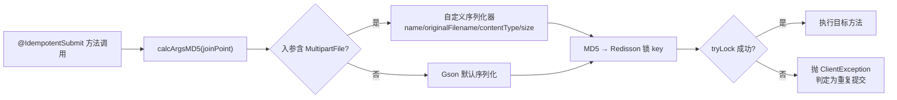

# UP-43 文件上传防重复摘要不再读取文件内容

上游对照提交：`2c178b47 optimize(framework): 修复文件上传防重复摘要栈溢出 (#62)`

## 功能介绍

`@IdempotentSubmit` 通过 `IdempotentSubmitAspect.calcArgsMD5()` 对方法入参做 MD5，得到防重复提交的锁标识。实现是 `new Gson().toJson(joinPoint.getArgs())`。

当入参是 `MultipartFile`（知识库上传接口）时，Gson 会尝试反射序列化 `StandardMultipartFile` 的内部结构（含 `Part`、`InputStream`、缓冲区等），出现两类问题：

1. **巨型字符串与栈溢出**：大文件会把字节内容递归展开为 JSON，占满内存甚至 StackOverflowError；
2. **摘要不稳定**：不同次上传同一文件的内部状态不同，导致同一请求两次生成不同锁标识，防重复能力失效。

本功能为 `MultipartFile` 注册 Gson 类型层级序列化器，只用**元信息**参与摘要：字段名、原始文件名、内容类型、字节大小。这样摘要计算不再读取文件内容，同一文件多次提交得到相同摘要，且不同文件（文件名不同）摘要不同。

## 验收标准

1. **一致性**：同名同类型文件，即使字节内容不同，摘要相同（证明未读取内容）；
2. **区分度**：文件名不同则摘要不同（防重复语义保留）；
3. **性能与稳定性**：对 20MB 级 `MockMultipartFile` 计算摘要不发生栈溢出/超长耗时；
4. 可执行验证：

```bash
./mvnw test -pl framework -Dtest=IdempotentSubmitAspectTest
```

期望结果：`Tests run: 1, Failures: 0, Errors: 0`。

## 代码位置

| 作用 | 位置 |
| --- | --- |
| 摘要计算与 Gson 配置 | `framework/src/main/java/com/nageoffer/ai/ragent/framework/idempotent/IdempotentSubmitAspect.java` |
| 注解 | `framework/src/main/java/com/nageoffer/ai/ragent/framework/idempotent/IdempotentSubmit.java` |
| 单元测试 | `framework/src/test/java/com/nageoffer/ai/ragent/framework/idempotent/IdempotentSubmitAspectTest.java` |

## 相关图表


