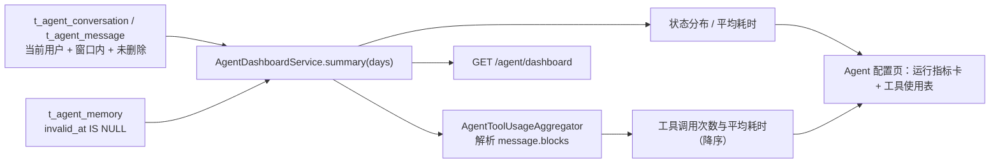

# UP-44（Agent 指标）Agent 运行指标视图

上游对照范围：`d0b744ea`（Agent 仪表盘主要组件与多引擎数据逻辑）、`62a81a58`（概览页布局重构）。

## 功能介绍

Agent 跑起来之后，第二个问题随之而来：**它工作得怎么样？** 会话有多少、回答成功还是经常失败、
写操作确认卡是不是总被搁置、哪个工具用得多且慢、记忆有没有真的在积累——这些只看聊天窗口看不出来。

本功能在 Agent 配置页顶部加一块**运行指标**（近 7 天，只统计当前登录用户自己的数据）：

| 指标 | 含义 |
| --- | --- |
| 会话数 / 消息数 / 回答数 | 使用量 |
| 平均耗时 | 助手消息的 `duration_ms` 均值（只算有耗时的） |
| 状态分布 | `NORMAL` / `CONFIRM_PENDING` / `INTERRUPTED` / `FAILED`（缺失归 `UNKNOWN`） |
| 工具使用 | 每个工具的调用次数与平均耗时，按次数降序 |
| 生效记忆 | 当前生效中的长期记忆条数 |

设计取舍：

1. **不建统计表**：会话、消息、状态都在既有表里；工具使用直接解析助手消息的 `blocks` 列聚合。统计口径与明细永远一致，也不会出现「补数据后统计对不上」。
2. **不跨用户聚合**：会话、消息、记忆都是用户私有数据，普通用户不应看到别人问过什么。真需要全局看板时另开管理端接口并做权限隔离。
3. **窗口受限**：默认 7 天、上限 90 天，避免一次扫全表。
4. **窗口内现算**：工具聚合是纯函数（`AgentToolUsageAggregator`），非法 JSON、缺字段都被安全跳过。

## 验收标准

1. **工具聚合**：同一工具多次调用合并计数并求平均耗时，按调用次数降序（次数相同按 toolId 稳定排序）；缺 latencyMs 按 0 计；blocks 为空、非法 JSON、非数组、缺 toolId 的条目都被跳过且不抛异常。
2. **状态分布**：按 message_status 计数，为空或缺失归入 UNKNOWN；空列表返回空分布。
3. **平均耗时**：只统计 duration_ms 为正的助手消息；无有效数据返回 0。
4. **窗口口径**：days 非正取 7；超过 90 截到 90；查询按 create_time 不早于窗口起点过滤，且只取当前用户、未删除数据。
5. **接口**：`GET /agent/dashboard?days=7` 返回会话数、消息数、回答数、状态分布、平均耗时、生效记忆、工具使用；Agent 未启用时接口不存在。
6. **页面**：Agent 配置页顶部展示指标卡与工具使用表；无数据时给出可读提示而不是空白。
7. 可执行验证：

```bash
./mvnw test -pl bootstrap -am '-Dtest=AgentToolUsageAggregatorTest,AgentDashboardServiceTest' -Dsurefire.failIfNoSpecifiedTests=false
cd frontend && npm run build
```

人工验收：在 Agent 对话页问两三个需要检索的问题，回到「Agent 配置」页刷新，指标应体现会话 / 消息数、工具调用次数与平均耗时。

## 代码位置

| 作用 | 位置 |
| --- | --- |
| 工具使用聚合（纯函数） | `bootstrap/src/main/java/com/nageoffer/ai/ragent/agent/admin/AgentToolUsageAggregator.java` |
| 指标汇总服务 | `bootstrap/src/main/java/com/nageoffer/ai/ragent/agent/service/AgentDashboardService.java` |
| 视图对象 | `bootstrap/src/main/java/com/nageoffer/ai/ragent/agent/controller/vo/AgentDashboardVO.java` |
| 接口 | `bootstrap/src/main/java/com/nageoffer/ai/ragent/agent/controller/AgentAdminController.java`（`GET /agent/dashboard`） |
| 前端接口与页面 | `frontend/src/services/agentService.ts`、`frontend/src/pages/admin/agent/AgentAdminPage.tsx` |
| 单元测试 | `bootstrap/src/test/java/.../agent/admin/AgentToolUsageAggregatorTest.java`、`agent/service/AgentDashboardServiceTest.java` |

## 相关图表



## 与上游的差异

- **不建 Agent 指标表与多引擎采集**：上游 `AgentDashboard*` 有自己的读取器与窗口模型，按多个数据源分别采集统计。本仓库直接从既有表与 blocks 现算，窗口内条数小、口径简单，不需要额外表；等指标量级上来再考虑物化。
- **不做概览页布局重构**：本仓库仪表盘是自研布局，照搬上游页面结构没有收益（见 [`up-44-frontend-remainder.md`](up-44-frontend-remainder.md)）。
- **只看当前用户**：上游仪表盘是管理视角；本仓库先做用户视角（隐私安全），全局看板需要时另开接口。
