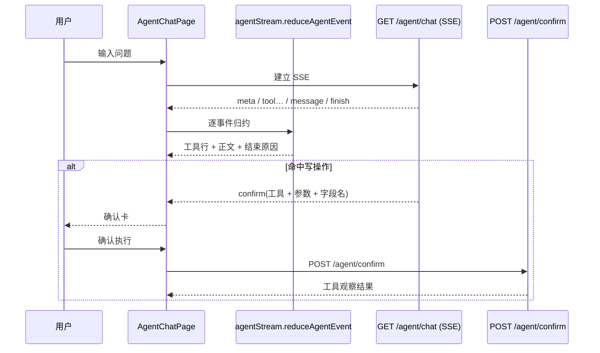

# UP-44（Agent 部分）Agent 对话页与工具/确认交互

上游对照范围：`d0b744ea` / `62a81a58` / `444bd161` 等前端与仪表盘提交中的 Agent 对话体验部分。

## 功能介绍

后端把 Agent 跑起来之后，用户还看不到任何东西：没有页面能发问、看不到模型在调什么工具、
写操作也没有确认入口。本功能补齐 Agent 的**前端交互面**：

| 能力 | 说明 |
| --- | --- |
| 对话 | 输入问题 → 走 `GET /agent/chat` SSE；事件按 `meta → tool… → (hint) → (confirm) → message → finish` 归约后渲染 |
| 工具过程 | 每步工具显示名称、参数摘要与耗时（RAG 版看不到这一类信息） |
| 提示 | 达到步数上限等运行提示以浅色文字展示，与正文区分 |
| **写操作确认卡** | 命中写工具时展示「工具 + 参数（带人工可读字段名）」与「确认执行 / 取消」；确认后调 `POST /agent/confirm` 并展示执行结果 |
| 历史会话 | 左侧会话列表支持打开与删除；打开时把 `user` / `assistant` 消息配对成轮次，并用消息里的 `blocks` 还原工具过程 |

事件归约与历史解析都放在 `frontend/src/lib/agentStream.ts`（纯函数、有单测），页面只负责渲染与请求：
后端将来新增事件类型时，未知事件被原样忽略，页面不会崩。

## 验收标准

1. **状态归约**：`meta` 置 `running=true` 与源会话 ID；`tool` 追加工具行；`hint` 追加提示；
   `confirm` 写入待确认调用；`message` 写入正文；`finish` 结束运行并保留结束原因。
2. **前向兼容**：未知事件返回原状态（不抛异常、不误改状态）。
3. **确认卡**：字段名优先用 `fieldLabels` 的中文说明，缺失时回退参数名；点「取消」不发起任何请求并提示未执行任何修改；
   点「确认执行」调 `POST /agent/confirm`，成功把工具观察结果追加到答案下方。
4. **历史回放**：`blocks` JSON 解析为工具行（非法 JSON 返回空数组）；缺 `toolId` / `step` 时有兜底值；
   `assistant` 消息没有对应 `user` 消息时也能展示。
5. **文案**：结束原因映射为中文（回答完成 / 达到工具调用上限 / 等待确认 / 直接回答 / 已停止 / 回答失败）。
6. **页面可用性**：未启用 Agent（`ai.agent.enabled=false`）时接口 404，页面给出明确错误提示而不是白屏。
7. 可执行验证：

```bash
cd frontend && npm run test:agent-chat && npm run build
```

期望结果：单测全通过、构建成功。

## 代码位置

| 作用 | 位置 |
| --- | --- |
| 事件归约与历史解析 | `frontend/src/lib/agentStream.ts` |
| 接口封装（含 SSE 复用既有 `createStreamResponse`） | `frontend/src/services/agentService.ts` |
| 页面 | `frontend/src/pages/AgentChatPage.tsx` |
| 路由 | `frontend/src/router.tsx`（`/agent`，需登录） |
| 单元测试 | `frontend/tests/agentStream.test.mjs`（`npm run test:agent-chat`） |

## 相关图表



## 与上游的差异

- 上游 Agent 页面带消息块级流式文本（`block` 事件封口）、思考区、工具卡片折叠等交互。本仓库当前是
  「工具行 + 正文」的紧凑版：引擎一次性给出最终回答，因此不需要块封口事件；文本级流式需要引擎改造
  （把最终回答改为流式下发）后再做。
- 上游把待确认调用与结算状态单独落表并支持批量确认；本仓库按 `message_status=CONFIRM_PENDING` +
  单次确认实现，见 [`up-34-write-confirmation.md`](up-34-write-confirmation.md) 的差异说明。
- Agent 管理台（`UP-33`：智能体配置、技能管理、记忆管理页）尚未做；当前记忆与技能通过配置文件与
  markdown 手册维护，接口层已备（`GET /agent/conversations`、`AgentMemoryService.listActive()`）。
