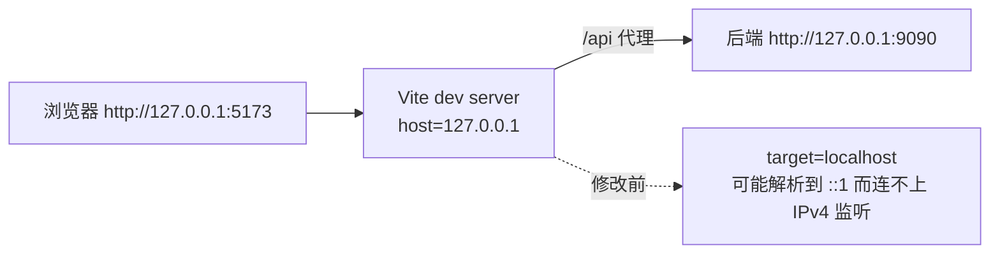

# UP-44（剩余项）前端开发体验与样式

上游对照范围：`d0b744ea`（Agent 仪表盘多引擎）、`62a81a58`（概览页布局重构）、`444bd161`（Vite 绑定 IPv4）、
`fff96c23`、`5b2cb080`（样式清理与会话行截断）。Agent 对话页部分见
[`up-44-agent-frontend.md`](up-44-agent-frontend.md)。

## 功能介绍

本仓库的前端是自研的（管理台布局、仪表盘、样式体系都与上游不同），因此 UP-44 里的条目要**逐条判断是否适用**：

| 上游条目 | 本仓库处理 |
| --- | --- |
| **开发服务器绑定 IPv4 回环** | ✅ 采用。`vite server.host=127.0.0.1`，代理目标同时从 `localhost` 改为 `127.0.0.1` |
| 概览页布局重构 | ⛔ 不采用：本仓库仪表盘是自研布局（与上游结构不同），照搬会重做一遍页面且没有对应收益 |
| Agent 仪表盘多引擎 | ✅ 按本仓库数据模型裁剪落地：见 [`up-44-agent-dashboard.md`](up-44-agent-dashboard.md)（会话 / 消息 / 状态分布 / 平均耗时 / 工具使用 / 记忆条数，用户视角，不建统计表） |
| 会话行「…」占位导致标题截断 | ⛔ 不适用：本仓库 Agent 会话列表用 `truncate` + `title`，没有该占位的 DOM 结构 |
| 删除 `.admin-layout .ui-card-content` 多余样式 | ⛔ 不采用：本仓库页面普遍显式传 `pt-6`/依赖该规则，删除它属于无收益改动（可能反而改变现有页面留白） |

为什么把「开发服务器绑定 IPv4」当成一个正经修复：开发机上 `localhost` 可能优先解析到 `::1`，而 Vite 默认
监听与后端监听可能落在不同协议族上，表现为「后端明明起着、前端代理却连不上」。显式绑定 IPv4 回环、
代理目标写 `127.0.0.1` 后，两侧协议族一致，问题不再随机器解析顺序变化。

## 验收标准

1. **开发服务器**：`npm run dev` 启动后只监听 `127.0.0.1:5173`（不再出现 `[::1]` 绑定导致的代理异常）。
2. **代理目标**：`/api` 转发到 `http://127.0.0.1:9090`（与本项目 `server.port=9090` 一致）。
3. **配置一致**：`vite.config.ts` 与仓库内同名编译产物 `vite.config.js` 保持同一份配置，避免改一个漏一个。
4. **不影响构建**：`npm run build` 仍然通过。
5. 可执行验证：

```bash
cd frontend && npm run build
```

人工验收：`npm run dev` 后访问 `http://127.0.0.1:5173`，登录并请求任意接口（如系统设置页），确认代理可用。

## 代码位置

| 作用 | 位置 |
| --- | --- |
| Vite 开发服务器与代理配置 | `frontend/vite.config.ts`、`frontend/vite.config.js` |
| 其它 UP-44 条目的判断依据 | 本文档上表 + [`up-44-agent-frontend.md`](up-44-agent-frontend.md) |

## 相关图表



## 与上游的差异

- 只采纳「开发服务器 IPv4 绑定 + 代理目标显式 IPv4」这一条，其余条目不适用或需要单独决策（见上表）。
- 上游 `vite.config.js` 是构建产物；本仓库两份都在仓库里，因此**两份同时修改**，避免配置分叉。
