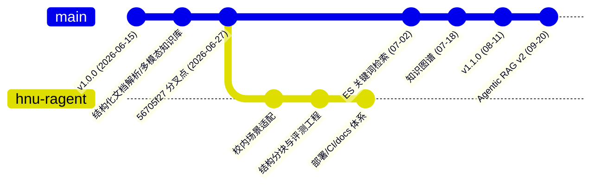

# 与上游 ragent 的分叉点判定

## 结论

本仓库从上游 `nageoffer/ragent` 分叉的确切位置是：

| 项目 | 值 |
| --- | --- |
| 上游仓库 | `https://github.com/nageoffer/ragent.git` |
| 分叉提交 | `56705f2780e4c9fa62723c06c134cb1d38b26ff4` |
| 提交说明 | `fix(schedule): 优化卡死文档状态恢复逻辑` |
| 提交时间 | 2026-06-27 17:33:54 +0800 |
| 相对版本 | `v1.0.0` 之后的第 7 个提交（`git describe` = `1.0.0-7-g56705f27`） |
| 本仓库当前 HEAD | `c55e4551`（2026-09-26，共 26 个本仓库自有提交） |
| 上游对齐时的 HEAD | `d0146b5e`（2026-09-20） |

也就是说：**本仓库 = 上游 `56705f27` 的工作树快照 + 校内适配与自研改造**；分叉之后上游又前进了 144 个提交（其中 141 个非合并提交），这些提交的内容在本仓库中基本不存在。

注意：本仓库的历史是重写过的（首个提交 `989a661b "âinit"`，2026-09-18，作者 `tangmenger`），与上游**没有共同的提交祖先**，因此不能用 `git merge-base` 判断分叉点，只能用文件内容比对（见下文证据）。

## 判定证据

### 证据一：共享文件内容首次出现位置的最大值

做法：取本仓库全部已跟踪文件的内容哈希，在上游 `HEAD` 的一级父链（803 个提交，从旧到新编号）上逐提交比对，记录每个文件内容**最早**和**最晚**出现在上游哪个提交。

结果：所有能在上游找到同内容文件的条目，其“最早出现位置”最大值是第 662 号提交，即 `56705f27`。也就是说本仓库的文件内容集合不会比它更新。

### 证据二：本仓库不含分叉点之后的任何上游改动

做法：对分叉点之后的每一个上游提交，把它改动的文件分别与“父提交版本”和“本提交新版本”比对，统计本仓库命中的是哪一个。

结果（截取分叉点之后最早的一批提交）：

| 位置 | 上游提交 | 说明 | 本仓库命中“新版本”的文件数 |
| --- | --- | --- | --- |
| 663 | `da91ae9b` | `feat(chunk): 实现块级贪心打包提升文本块合并效果` | 0 |
| 667 | `461d7966` | `feat(keyword): 集成基于 Elasticsearch 的关键词检索与索引功能` | 0 |
| 670 | `950637ec` | `feat(knowledge): 实现知识库删除时底层资源异步清理机制` | 0 |
| 675 | `951d813e` | `feat(audit): 集成审计日志及变更记录功能` | 0 |
| 676 | `7cbb02c4` | `refactor(storage): 移除 S3 存储相关旧代码，新增抽象文件存储服务接口` | 0 |
| 678 | `6a1ecf7f` | `feat(rag): 新增 You.com 联网检索通道与 youcom_search MCP 工具` | 0 |

整条链上“命中新版本”的文件数始终为 0：分叉之后上游的任何一次改动都没有进入本仓库。这与证据一互相印证，把分叉点唯一锁定在 `56705f27`。

### 证据三：结构性与语义性交叉验证

本仓库不存在分叉点之后才引入的能力：

- 没有 Elasticsearch 关键词检索通道实现（`SearchChannelType` 中该类型仅有枚举/注释占位）；
- 没有知识图谱（Neo4j）相关代码与图谱检索通道；
- 没有审计日志、系统配置设置接口、推荐追问、回答来源溯源；
- 没有 Agent 执行架构 / Skills / LangFuse / DeepSeek 供应商 / 模型调用档位；
- 仍保留上游在 `7cbb02c4` 中删除的 S3 存储实现（`S3Fetcher`、`S3FileStorageService` 等）。

反向验证：分叉点的 7 个提交（含 `refactor(core): 引入多模态结构化文档解析与块切分支持`、`feat(knowledge): 持续完善知识库多模态能力，支持多文件类型和表格优化`）带来的文件在本仓库中**逐字节一致**存在，例如 `bootstrap/src/main/java/com/nageoffer/ai/ragent/core/parser/ParserType.java`、`core/parser/excel/ExcelTableNormalizer.java`、`frontend/src/lib/csvToMarkdown.ts`。

### 证据四：分叉点之后本仓库的自研改动

相对分叉点，上游 `56705f27` 与本仓库共享的 644 个文件逐字节一致；另有 67 个共享文件被本仓库改造，集中在：

- 提示词与业务场景：`bootstrap/src/main/resources/prompt/*.st`（校内场景改写）；
- 配置与依赖：`application.yaml`、根 `pom.xml`、`bootstrap/pom.xml`；
- 前端品牌与页面：`frontend/src/pages/**`、`frontend/src/components/**`；
- 意图与分块：`rag/core/intent/*`、`core/chunk/blockaware/*`。

同时本仓库新增了 299 个上游当时不存在的文件（按本仓库当前文件清单统计），主要是 `docs/` 文档体系、`deploy/` 部署与 CI、`.specify/` 与 `.agents/` 规范、`ragenteval-main/` 评测工程、`wechat-crawl/` 抓取脚本、以及自研的 `StructuredChunkAggregator`、RAG 调试接口与相关测试。

## 复核方法

上游克隆到本地后可用下列命令复核（本仓库工作树保持不变）：

```bash
# 1. 上游提交是否仍在（分叉点应能定位到具体提交）
git -C <upstream> describe --tags 56705f2780e4c9fa62723c06c134cb1d38b26ff4
# 期望输出：1.0.0-7-g56705f27

# 2. 分叉点之后上游前进了多少
git -C <upstream> rev-list --count --no-merges HEAD --not 56705f27
# 期望输出：141

# 3. 本仓库与分叉点共享文件的差异规模
git -C <upstream> diff --shortstat 56705f27 1.1.0
```

## 相关图表



| 对照项 | 分叉点 `56705f27` | 本仓库现状 | 上游 `d0146b5e` |
| --- | --- | --- | --- |
| 模块结构 | `bootstrap` / `framework` / `infra-ai` / `mcp-server` | 同左，保持未拆 | 增加 `agent` / `rag` / `system` 拆分 |
| 检索通道 | 向量全局 + 意图定向 | 同左（自研调试接口） | 向量 + 关键词 + 图谱 + 联网 |
| 编排模式 | 仅 RAG 管道 | 仅 RAG 管道 | RAG + Agent（ReAct）+ WorkFlow |
| 文档体系 | 无 | `docs/` 全套 + 评测工程 | README 为主 |

## 后续动作

1. 按 [`feature-gap.md`](feature-gap.md) 的功能清单分批落地，每项功能先写 `features/` 下的实现文档。
2. 每落地一项就在 [`roadmap.md`](roadmap.md) 更新状态，避免“已实现但无记录”。
