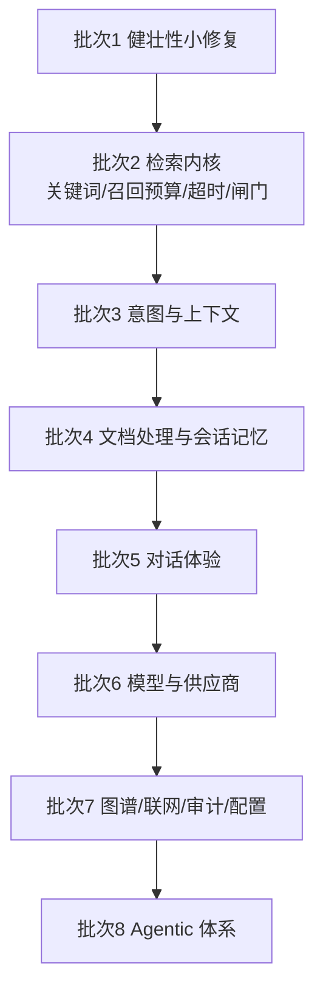

# 上游功能落地路线图

本文件是 [`feature-gap.md`](feature-gap.md) 中差异清单的**实施计划与状态跟踪**。每项功能落地前先补 `features/` 下的实现文档，落地后更新本文件状态列。

状态口径：`未开始` / `文档就绪` / `实现中` / `已落地（含验证）`。

## 分批原则

1. **先修正确性与健壮性，再补大能力**：小修复风险低，能立刻降低线上问题概率。
2. **先补检索内核，再补表现层**：关键词检索、召回预算、相关性闸门会改变召回质量，是其它功能的地基。
3. **先补数据脚本，再补依赖数据的代码**：涉及新表/新字段的功能必须先有 `resources/database/` 脚本。
4. **大功能独立分批**：知识图谱、审计、Agent 体系各自成批，避免改动面互相纠缠。
5. **不搬运模块架构**：本仓库保持 `bootstrap` / `framework` / `infra-ai` / `mcp-server` 边界，上游的 `agent`/`rag`/`system` 拆分只作为组织代码的参考。

## 批次与状态

### 批次 1：健壮性小修复（低风险，先做）

| 编号 | 功能 | 功能文档 | 状态 |
| --- | --- | --- | --- |
| UP-02 | 空意图树跳过 LLM 分类 | [`features/up-02-empty-intent-tree.md`](features/up-02-empty-intent-tree.md) | 已落地（含验证） |
| UP-04 | 远程刷新 ETag 修复 | [`features/up-04-remote-refresh-etag.md`](features/up-04-remote-refresh-etag.md) | 已落地（含验证） |
| UP-42 | 事务消息与 MQ 修复 | [`features/up-42-mq-fixes.md`](features/up-42-mq-fixes.md) | 已落地（含验证） |
| UP-43 | 文件上传防重复摘要栈溢出 | [`features/up-43-upload-dedup-stack.md`](features/up-43-upload-dedup-stack.md) | 已落地（含验证） |

### 批次 2：检索内核

| 编号 | 功能 | 功能文档 | 状态 |
| --- | --- | --- | --- |
| UP-06 | Elasticsearch 关键词检索通道 | [`features/up-06-es-keyword-channel.md`](features/up-06-es-keyword-channel.md) | 已落地（含验证） |
| UP-01 | 检索通道配置一致性校验（依赖 UP-06 引入的后端类型开关） | [`features/up-01-channel-config-validation.md`](features/up-01-channel-config-validation.md) | 已落地（含验证） |
| UP-07 | 全局召回预算与通道统一 | `features/up-07-recall-budget.md` | 未开始 |
| UP-08 | 通道级超时降级 | [`features/up-08-channel-timeout-degrade.md`](features/up-08-channel-timeout-degrade.md) | 已落地（含验证） |
| UP-09 | Rerank 证据相关性闸门 | [`features/up-09-evidence-gate.md`](features/up-09-evidence-gate.md) | 已落地（含验证） |
| UP-05 | 入库流水线健壮性 | [`features/up-05-ingestion-robustness.md`](features/up-05-ingestion-robustness.md) | 已落地（含验证） |

### 批次 3：意图与上下文

| 编号 | 功能 | 功能文档 | 状态 |
| --- | --- | --- | --- |
| UP-10 | 意图关联多知识库 Collection（UP-03 依赖本项引入的多 Collection 字段） | `features/up-10-intent-multi-collection.md` | 未开始 |
| UP-03 | 意图缓存反序列化容错（依赖 UP-10） | `features/up-03-intent-cache-robustness.md` | 未开始 |
| UP-12 | 检索结果元数据富化与上下文渲染 | `features/up-12-context-enrichment.md` | 未开始 |
| UP-30 | 数据库 v1.1.0 升级脚本体系 | `features/up-30-db-upgrades.md` | 未开始 |
| UP-11 | 意图歧义澄清重构 | `features/up-11-ambiguity-rewrite.md` | 未开始 |

### 批次 4：文档处理与会话记忆

| 编号 | 功能 | 功能文档 | 状态 |
| --- | --- | --- | --- |
| UP-13 | 分块策略重构（贪心打包/重叠/图片合并） | `features/up-13-chunking-refactor.md` | 未开始 |
| UP-17 | 会话摘要与上下文裁剪 | `features/up-17-memory-compaction.md` | 未开始 |
| UP-15 | 知识库删除异步资源清理 | `features/up-15-async-cleanup.md` | 未开始 |
| UP-16 | MinerU 并发控制重构 | `features/up-16-mineru-semaphore.md` | 未开始 |
| UP-14 | 文件存储抽象 | `features/up-14-storage-abstraction.md` | 未开始 |

### 批次 5：对话体验

| 编号 | 功能 | 功能文档 | 状态 |
| --- | --- | --- | --- |
| UP-18 | 回答来源与文档预览 | `features/up-18-answer-sources.md` | 未开始 |
| UP-19 | 相关推荐追问 | `features/up-19-follow-up-questions.md` | 未开始 |
| UP-20 | 消息结束状态与顺序稳定性 | `features/up-20-stream-order.md` | 未开始 |
| UP-38 | 任务取消与中断反馈 | `features/up-38-task-cancellation.md` | 未开始 |

### 批次 6：模型与供应商

| 编号 | 功能 | 功能文档 | 状态 |
| --- | --- | --- | --- |
| UP-22 | 模型调用档位机制 | `features/up-22-model-tiers.md` | 未开始 |
| UP-21 | 模型调用健壮性（空白响应/熔断名额/候选顺序） | `features/up-21-model-call-robustness.md` | 未开始 |
| UP-24 | DeepSeek 供应商 | `features/up-24-deepseek-provider.md` | 未开始 |
| UP-25 | `enable_thinking` 自定义参数 | `features/up-25-enable-thinking.md` | 未开始 |
| UP-23 | 百炼向量客户端对齐 | `features/up-23-bailian-embedding.md` | 未开始 |

### 批次 7：独立大功能

| 编号 | 功能 | 功能文档 | 状态 |
| --- | --- | --- | --- |
| UP-27 | 知识图谱（Neo4j）与图谱检索通道 | `features/up-27-knowledge-graph.md` | 未开始 |
| UP-26 | You.com 联网检索通道 | `features/up-26-web-search-channel.md` | 未开始 |
| UP-28 | 审计日志与变更记录 | `features/up-28-audit-log.md` | 未开始 |
| UP-29 | 系统配置页与设置接口 | `features/up-29-system-settings.md` | 未开始 |

### 批次 8：Agentic 体系（最大改动，最后做）

| 编号 | 功能 | 功能文档 | 状态 |
| --- | --- | --- | --- |
| UP-31 | Spring Boot 4 升级 | `features/up-31-spring-boot4.md` | 未开始 |
| UP-32 | 模块拆分与 Agent 执行架构 | `features/up-32-agent-runtime.md` | 未开始 |
| UP-33 | 智能体管理与配置 | `features/up-33-agent-admin.md` | 未开始 |
| UP-34 | Agent 写操作确认流程 | `features/up-34-write-confirmation.md` | 未开始 |
| UP-35 | Skills 体系 | `features/up-35-skills.md` | 未开始 |
| UP-36 | Agent 长期记忆 | `features/up-36-agent-memory.md` | 未开始 |
| UP-39 | MCP 工具目录与 Schema 构造器 | `features/up-39-mcp-tool-catalog.md` | 未开始 |
| UP-40 | MCP 身份透传 | `features/up-40-mcp-identity.md` | 未开始 |
| UP-37 | LangFuse 链路追踪 | `features/up-37-langfuse.md` | 未开始 |
| UP-41 | 初始化器与场景示例 | `features/up-41-initializer.md` | 未开始 |
| UP-44 | 前端与仪表盘体验 | `features/up-44-dashboard.md` | 未开始 |

## 每项功能的完成定义（DoD）

一项功能只有在下列条件全部满足时才标记为 `已落地（含验证）`：

1. `features/` 下存在对应实现文档，且四节（功能介绍、验收标准、代码位置、相关图表）齐全并反映最终实现；
2. 代码位于文档声明的模块与包路径，未破坏 `bootstrap -> framework + infra-ai` 依赖方向；
3. 新增配置项已写入 `bootstrap/src/main/resources/application.yaml` 并以 `@ConfigurationProperties` 绑定；
4. 行为变化有对应测试或可复现的验收步骤（检索顺序、阈值、TopK、状态语义变化必须属于此类）；
5. 如涉及表结构或数据口径，`docs/database/README.md` 与 `resources/database/` 脚本同步更新；
6. 相关的 `docs/rules/` 不变量已更新，`node test/validate-ai-dev-template.mjs` 通过。

## 相关图表

