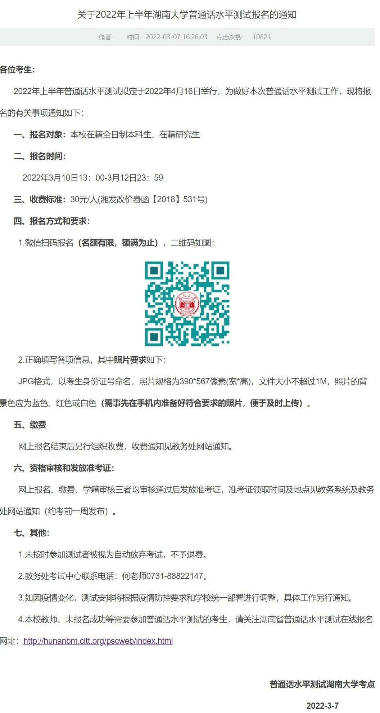

# 湖大四六级|计算机|普通话|教资|体育测试等考试信息汇总

- 公众号：湖大有话说
- 作者：湖南大学万能墙
- 日期：2023-07-24
- 原文：https://mp.weixin.qq.com/s?src=11&timestamp=1790357643&ver=6988&signature=nGNZgjFcvYQZjkjASEXVfhV30tN1tKyEaxzsjsMFP99hARkQE*3EmUgUkgxIADwgMNDBG*8IMtPEaCY2Sbwsqa6f-eyIXqhIsdO9DRnD8NwzxUPxJULqdEhAtFKfVz1J&new=1

[图片]此处汇总了大学生儿常见的几次考试的相关信息，还有需要补充或者有误的地方欢迎各位小可爱联系墙墙微信（HNU1022）反馈呀！

英语四、六级

1、一般报名时间：每年两场考试，分别在6月和12月，报名通常会提前三个月，也就是3月和9月，通常报名前几天学校教务处网站会发通知，通知会发到各学院通知群，小可爱们要注意关注通知信息。

2、报名方式：报名网址：http://cet-bm.neea.cn；注意网上缴费必须24小时以内完成，超过24小时缴费报名无效须重新报名

3、成绩查询：一般笔试后60个工作日后会出成绩，查询时间小可爱们可以自行估算，墙墙也会在QQ空间发布相关通知，大家可以关注嗷！

4、成绩查询方式：登录中国教育考试网，输入姓名和身份证号即可查询，网址：https://cjcx.neea.edu.cn/html1/folder/21033/653-1.htm

全国计算机等级考试

1、一般报名时间：每年两场考试，分别在3月、9月，一般提前三个月报名，准备好就可以考试啦！

2、报名方式与成绩查询入口：https://ncre.neea.edu.cn/

普通话水平测试

分为校内考试和校外考试两种

1、一般报名时间：校外考试一个月一次，校内考试半年和下半年各一次，基本在4、5月和10月

2、报名方式：

校内：学校教务处会发通知，如图，

[图片]

校外：关注【湖南省语言文字培训测试中心】微信公众号，会发报名通知，一个月一次

3、成绩查询：百度或微信直接搜索“普通话成绩查询”，输入姓名和身份证号即可查询

中小学教师资格考试

1、一般报名时间和考试时间：分笔试和面试，一年各两次，2022年笔试报名时间为1月和9月，考试时间为3月和10月底，面试报名在笔试考试之后。

2、报名方式：https://www.neea.edu.cn/

3、成绩查询：https://cjcx.neea.edu.cn/

湖南大学体育测试

1、时间：一年一次，一般是在秋季学期

2、免体测问题：

必须带着相关病情证明到校医院保健科盖章，再到自己学院盖章，然后把纸质证明拍下来上传免测系统（个人门户体制测试里面找），然后把免测证明交到南校体育馆一楼体测办公室。

（详细补充：要有三甲医院开的证明，下载免测表。先去院里盖章，再到校医院旁边的健康管理中心二楼，询问一下前面的咨询出，她会让你去一个房间复检，把证明给房间的那个医生，她复检好后会填写意见，再到前面咨询的医生那里盖章。免测表盖好章后，拍照上传到个人门户的体质测试免测申请里，再把免测表交到南校体育馆一楼的免测箱中。）

ps:申请免测后体测有成绩，就是60；然后具体怎么申请可以去南校区体育馆一楼有个体育学院体测室咨询那里的老师

3、成绩查询：体测当天就可以在“湖南大学微生活”小程序查询（稍有延迟）

关于挂科

[图片]之前一直有小可爱问大学考试挂科的定义以及挂科的影响[图片]

一般来说，总评成绩（含平时、期中期末成绩占比）不超过60分即为挂科（单单期末成绩没过60还是有不挂科的机会在的......），核心课程挂科会影响保研以及各类奖项评选，选修课挂科不影响保研但会影响奖学金评选。（各院或任课老师可能会有不同的要求，小可爱们根据具体情况考虑嗷！）挂科是件耗时耗力还耗钱的事儿，小可爱们还是要好好学习呀！

[图片]

## 图片

