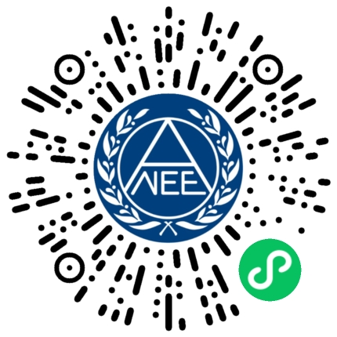
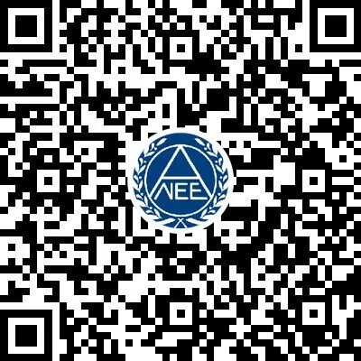
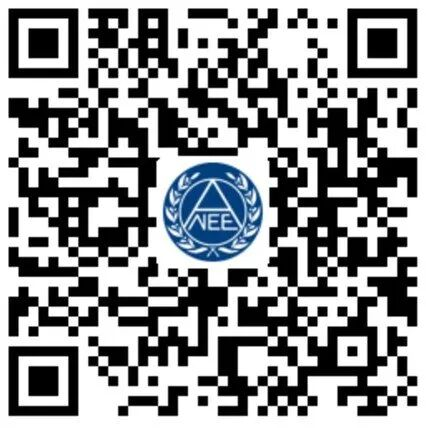

# 明天上午！湖大四六级成绩查询时间定了

- 公众号：湖大有话说
- 作者：逢考必过的
- 日期：2023-08-23
- 原文：https://mp.weixin.qq.com/s?src=11&timestamp=1790357636&ver=6988&signature=nGNZgjFcvYQZjkjASEXVfhV30tN1tKyEaxzsjsMFP98X*w*AZH7i*w8ef*Ofcp4m1z0vfYh4BFjJUAOLAtwnlo8rLNlZt2ulsrscIviZridpZwUD0T5ph2Ff2gYViq6a&new=1

2023年上半年全国大学英语四、六级考试（CET）成绩查询服务将于2023年8月24日开通，有关安排如下：

　　一、开通时间

　　2023年8月24日 上午7时

　　二、查询内容

　　2023年上半年CET全国大学英语四、六级考试成绩

　　三、查询方法

　　1.中国教育考试网

　　网址: http://cet.neea.edu.cn/cet

　　2.中国教育考试网微信小程序

　　使用微信APP扫描下方小程序码或搜索“中国教育考试网”小程序。　

[图片]　

　　3.中国教育考试网百度小程序

　　使用百度APP扫描下方小程序码或搜索“中国教育考试网”小程序。　

[图片]

　　4.中国教育考试网支付宝小程序

　　使用支付宝APP扫描下方小程序码或搜索“中国教育考试网”小程序。　　

[图片]

　　四、电子成绩报告单

　　9月1日9时起，考生可登录中国教育考试网（www.neea.edu.cn），免费查询、下载本次考试电子成绩报告单。

更多通知，扫码添加下方墙墙微信好友查看哦~

[图片]

## 图片

