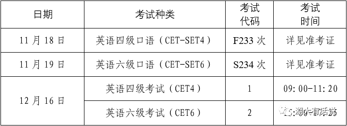

# 关于2023年下半年全国大学英语四、六级笔试考试和口语考试报名的通知

- 公众号：湖大有话说
- 作者：分享湖大资讯的
- 日期：2023-09-12
- 原文：https://mp.weixin.qq.com/s?src=11&timestamp=1790357541&ver=6988&signature=nGNZgjFcvYQZjkjASEXVfhV30tN1tKyEaxzsjsMFP9-bkeeEqgfcnG4G2S98nu1xVEkIlcS-6YfKp-0T*KGEziwnG*rBUKcyErbbueA-lA-bJmyTX-6UTu0s1*Tp7Chp&new=1

各学院、各同学：

根据统一安排，2023年下半年全国大学英语四、六级考试（CET）和口语考试（CET-SET）即将开始报名，现将有关事项通知如下：

一、语种级别及考试时间

[图片]

二、报名条件

1.我校在籍本科生、研究生；

2.报考四级无其他条件限制，报考六级需要四级历史最高成绩达到425分（包括425分）；

3.英语四级与六级不兼报，口语考试禁止跨校报考；

4.2023年上半年大学英语六级考试缺考者本次停报；

5.完成本次CET4笔试报名后可报考CET-SET4，完成本次CET6笔试报名后可报考CET-SET6；

6.四级、六级考试均开放校内最大考场容量，报满为止。

三、报名时间

本次报名分两个阶段进行。

第一阶段：9月15日15:00至9月18日10:00，此阶段仅对未报名参加过CET6考试的本科生，及CET6考试成绩未达到425分的本科毕业生开放;

第二阶段：9月18日13:00至9月22日16:00，此阶段对我校符合报名条件的全部考生开放。

四、收费标准（湘发改价费规[2023]468号）

1.四级:26元/人

2.六级:28元/人

3.CET-SET：50元/人

五、报名、缴费及相片要求

1.考生自行登录考试报名网http://cet-bm.neea.edu.cn进行报名，完成个人信息确认、选择报考科目、网上缴费等报名手续；

2.本次报名将启用“手机验证码登录报名平台”与“身份证实名验证”双重安全检测功能，如果未使用本人手机注册或身份证被他人占用，将无法进行报名（需另行“人工验证”，时间可能较长）。为确保顺利、快速报名，请提早完成报名网站(https://passport. neea. edu. cn)的用户注册及手机验证，以免耽误报名，如发现个人信息(身份证号、手机号等)被占用，请尽早上传“手持证件照”进行人工核验；

3.网上缴费必须在24小时内完成，超过24小时则报名无效，须重新报名；

4.报名页面未显示照片的考生，请将以身份证号命名的照片发送至指定邮箱：277482882@qq.com。相片要求144像素×192像素（宽*高），大小6～10KB，存储格式为：身份证号.jpg。

六、成绩报告单

纸质成绩单依申请发放，考生可在报名期间或成绩发布后规定时间内登录CET报名网站（http://cet-bm.neea.edu.cn）自主选择是否需要纸质成绩报告单。CET成绩发布10个工作日后，考生可登录中国教育考试网（www.neea.edu.cn）查看并下载电子成绩报告单，电子成绩报告单与纸质成绩报告单具有同等效力。

七、其他事项

1.请各学院将本通知下发至各班级，并及时通知在外实习的学生；

2.学校不提倡已通过考试的学生反复刷分，请尽量将考试机会让给更有需要的同学；

3.所有考生一律凭准考证和有效身份证件参加考试，证件不齐者禁止参加考试；

4.大学英语六级缺考的学生将停考一次大学英语四、六级，请按时参加考试；

5.准考证需要考生自行登录报名系统打印：

口试准考证11月13日9:00开始打印，笔试准考证12月7日9:00开始打印；

6.联系方式：

教务处考试中心（前进楼101室）联系人：李老师，联系电话：0731-88822147。

全国大学英语四、六级考试

湖南大学考点

2023年9月12日

Via | 湖南大学教务处

也可以添加墙墙微信获取各类校园通知哦~↓

墙墙微信：HNU1022

[图片]

[图片]

点分享

[图片]

点收藏

[图片]

点点赞

[图片]

点在看

## 图片

