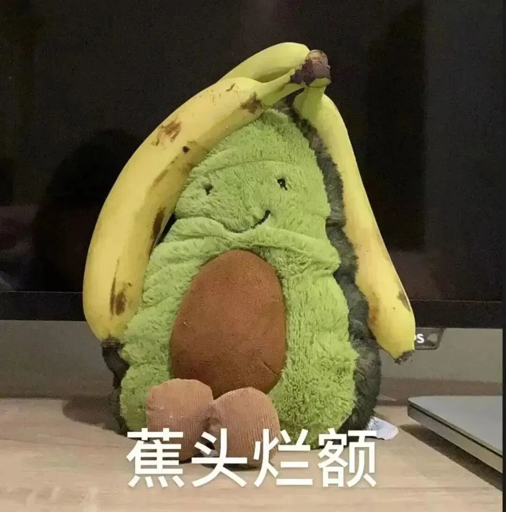
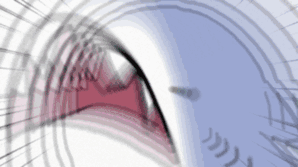
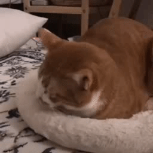
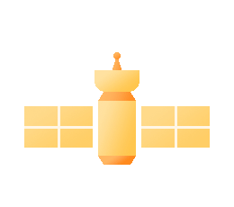

# 湖大人为什么喜欢带饭回宿舍？

- 公众号：湖大有话说
- 作者：好好干饭的
- 日期：2023-11-17
- 原文：https://mp.weixin.qq.com/s?src=11&timestamp=1790357541&ver=6988&signature=nGNZgjFcvYQZjkjASEXVfhV30tN1tKyEaxzsjsMFP9*eCkLHvy8qEC0h4INhCzJ1po5ircgdXxi2LcnoC5YNTWGOcdinUvHdAAuFUMMGTKm8ZR175rZRFLia47K03j-I&new=1

▲

99.99%的湖大学子关注了我们

在湖大有一种现象

进入大学的时间越长

越喜欢打包饭回宿舍吃

刚进入大学的时候

还坐在食堂吃饭呢！

今天小湖

就来给大家盘点一下

大家越来越喜欢

打包饭回宿舍多吃的原因

[图片]

“吃饭很惬意，喜欢边刷剧边吃”

[图片]

电子榨菜的重要性不用我多说了

俗话说的好:

"吃饭追剧，剧香，饭更香"

除了熬夜刷剧

有多少人是在吃饭时打开

还没来得及看的综艺

或电视剧边吃边看的

每次吃饭时打开一些

总是深夜刷到的吃播视频

那感觉真是美滋滋

[图片]

仿佛自己吃的就是视频里的各种美食

那就一个香！

[图片]

“好社恐”

[图片]

对于社恐人来说

能够打包带饭回宿舍简直是天大的好事
在食堂吃饭社恐是真的会

食不下咽

浑身不自在
还得时刻注意着怕遇到个熟人
人多时去食堂简直是

社恐的灾难时刻
密密麻麻的人潮
买饭已经很痛苦了

[图片]

要是在食堂吃饭
还有可能面临和陌生人拼桌
是光想想就会令社恐头皮发麻的场景[图片]

社恐人绝对不会在食堂吃饭！

[图片]

“一个人太孤单了！”

[图片]

众所周知
一个人吃火锅是孤独的高等境界
可能有人不能理解为什么
一个人在中午12点的食堂吃饭
那真的是比一个人吃火锅还要孤独

[图片]

别人都要么成双成对

三五成群
一个人在食堂就显得格格不入
别人吃饭时有说有笑
一个人就只能默默听着别人聊天
自己在心里和自己聊天

在宿舍吃饭虽然大家各吃各的
但在一个空间里

又都是相熟的人

总是要比在食堂吃饭热闹些的

[图片]

“高峰期抢座位太难了”

[图片]

对于有上午

上课到十二点和

下午第一节课的同学

下课赶到食堂
座位基本已经被占的满满的
每个窗口都排着超长的队
先占座再吃饭容易被吐槽

先买饭再找座
举着个饭盘子

在人潮中找座位是真的很难

等找到座位坐下吃完饭

可能都快1点多了
还得赶着去上下午第一节课
中午休息时间完全不够

[图片]

但是如果直接打包带饭回宿舍的话

[图片]

“吃土人不配在食堂吃饭”

[图片]

某些人人前光鲜亮丽
谁能想到他们只能每天
在宿舍吃馒头＋老干妈
泡面已经是奢侈品了

谁让他们控制不住消费的欲望

[图片]

今年的双十一才刚刚过去
让小湖看看是谁

已经开始了

依靠泡面、老干妈吃土了[图片]

[图片]

“择偶权还想要！”

[图片]

一些精致的同学

对于外在形象都是比较注重的
每次出门起码都得收拾好半天
但没有课的早上
谁愿意花大半天时间收拾自己
只为去食堂买个饭呢

但邋里邋遢在食堂吃饭
万一碰巧遇到自己心仪的人
那岂不是形象破灭

[图片]

所以对于各位精致的宝子们
只有快速的买完饭带回宿舍
才能不用顾忌自己的形象
在宿舍想吃多少吃多少[图片]

放下自己的偶像包袱

[图片]

经常有湖大人把饭带回食堂

但小湖要提醒大家

不要带一些味道大的食物回宿舍哦

吃完饭也要开窗通风

垃圾也要早早丢掉

营造一个良好的寝室氛围哦！

[图片]

湖南大学PPT模板大合集来啦~进来领取！

创意来源：农苑通

想要更及时获取湖大资讯

可以将“湖大有话说”公众号设为星标哦！

也可以添加墙墙QQ获取各类校园通知哦~↓

湖南大学万能墙QQ：3441628374

[图片]

## 图片

