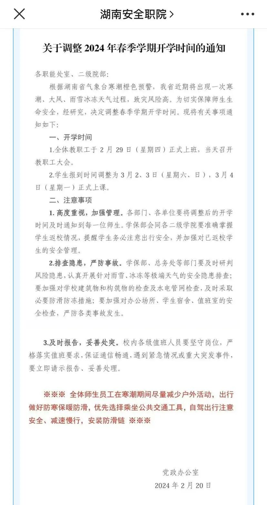
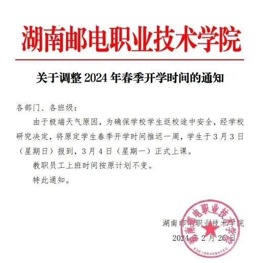
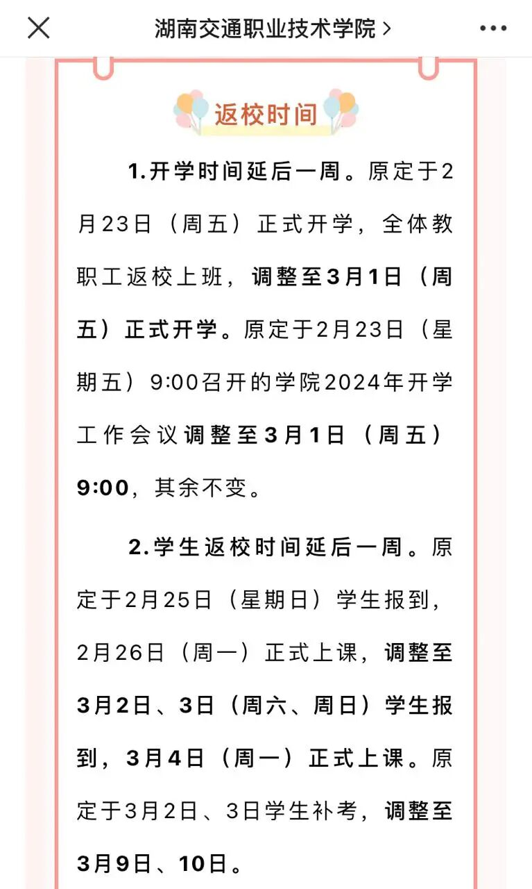
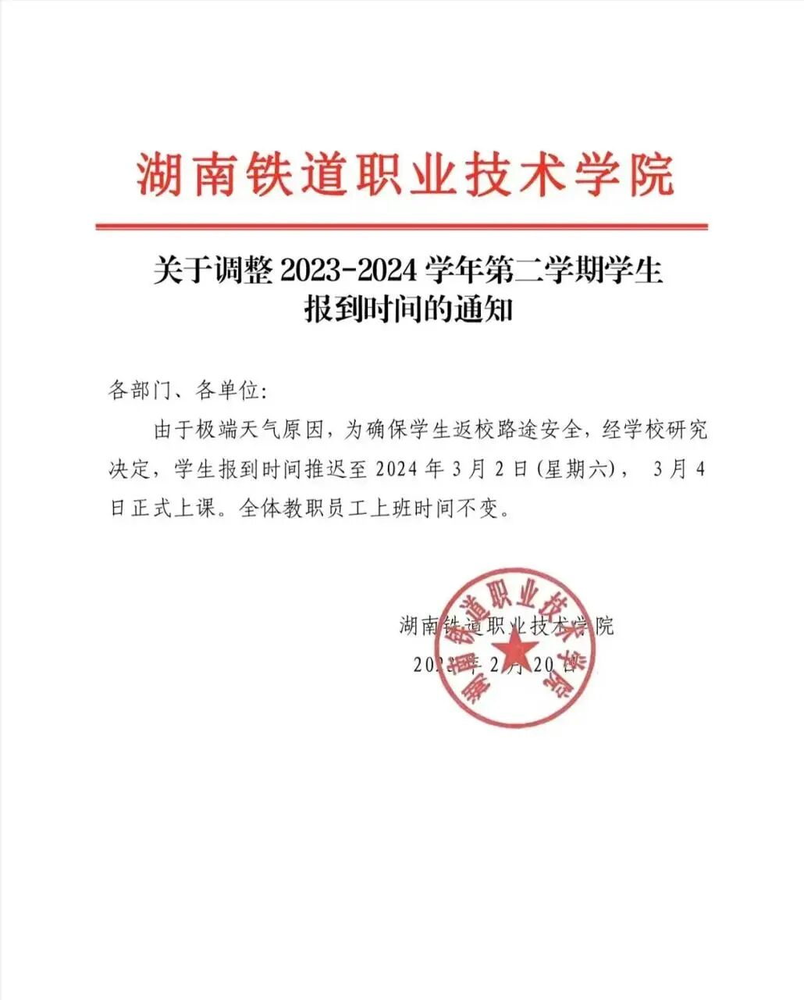

# 湖南多所高校推迟开学

- 公众号：湖大有话说
- 作者：待你归来的
- 日期：2024-02-21
- 原文：https://mp.weixin.qq.com/s?src=11&timestamp=1790357541&ver=6988&signature=nGNZgjFcvYQZjkjASEXVfhV30tN1tKyEaxzsjsMFP9*9RX5FY-NbY3KIUDWj8juJfH3kJs*QiuW1ywAYu0nBPwFFh6j6ai*36gEK6ULqN66qzwfk3eSIZb*nGe2XddP7&new=1

为了应对低温雨雪冰冻灾害天气，湖南多所高校发布通知，调整春季学期学生开学时间。

湖南安全职院 

2月20日晚，湖南安全职院发通知表示，为保障师生安全，学校决定调整2024年春季学期开学时间。其中开学时间为：全体教职工于2月29日（星期四）正式上班，当天召开教职工大会。学生报到时间调整为3月2日、3月3日（星期六、星期日），3月4日（星期一）正式上课。

[图片]

湖南邮电职业技术学院 

同一天，湖南邮电职业技术学院发出关于调整2024年春季开学时间的通知，表示由于极端天气原因，为确保学校学生返校途中安全，经学校研究决定，将原定学生春季开学时间推迟一周，学生于3月3日(星期日)报到，3月4日(星期一)正式上课。教职员工上班时间按原计划不变。

[图片]

湖南交通职业技术学院

湖南交通职业技术学院也发通知表示开学时间延后一周，原定于2月23日（周五）正式开学，全体教职工返校上班，调整至3月1日（周五）正式开学。原定于2月23日（星期五）9:00召开的学院2024年开学工作会议调整至3月1日（周五）9:00，其余不变。同时学生返校时间延后一周。原定于2月25日（星期日）学生报到，2月26日（周一）正式上课，调整至3月2日、3日（周六、周日）学生报到，3月4日（周一）正式上课。原定于3月2日、3日学生补考，调整至3月9日、10日。

[图片]

湖南铁道职业技术学院

2月20日晚，湖南铁道职业技术学院发通知调整学生报到时间：由于极端天气原因，为确保学生返校路途安全，经学校研究决定，学生报到时间推迟至2024年3月2日（星期六），3月4日正式上课。全体教职员工上班时间不变。

[图片]

除了湖南铁道职业技术学院之外，位于株洲市的其他高职院校也推迟开学时间。据株洲发布，株洲师范高等专科学校、湖南汽车工程职业技术学院、湖南中医药高等专科学校和湖南航空技师学院开学时间均推迟一周，均为3月4日正式上课。

转载于：青年湖南[图片]

## 图片

