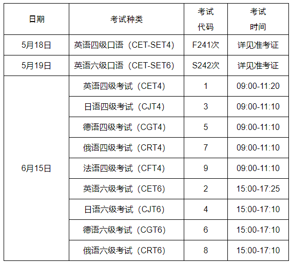

# 2024年上半年四六级报名通知

- 公众号：湖大有话说
- 作者：分享考试资讯的
- 日期：2024-03-18
- 原文：https://mp.weixin.qq.com/s?src=11&timestamp=1790358595&ver=6988&signature=nGNZgjFcvYQZjkjASEXVfhV30tN1tKyEaxzsjsMFP9-BLOU97Rw4s9yZ7mGThCz0chulZ0RgItEavqxeh*j8EbZH-zk4gMZN0WWun8dBEnSSDLBZPJab2yb0FTCA-33U&new=1

关于2024年上半年全国大学英语四、六级笔试考试和口语考试报名的通知

各学院，各位同学：

根据统一安排，2024年上半年全国大学英语四、六级笔试考试（CET）和口语考试（CET-SET）即将开始报名，现将有关事项通知如下：

一、语种级别及考试时间

[图片]

二、报名条件

1.我校在籍本科生、研究生；

2.报考四级无其他条件限制，报考六级需要四级历史最高成绩达到425分（包括425分）；

3.英语四级与六级不兼报，小语种考试不做限制；

4.2023年下半年大学英语六级考试加考缺考者本次停报；

5.小语种和口语考试禁止跨校报考；

6.完成本次CET4笔试报名后可报考CET-SET4，完成本次CET6笔试报名后可报考CET-SET6；

7.四级、六级考试均开放校内最大考场容量，报满为止。

三、报名时间

本次报名分两个阶段进行。

第一阶段：3月20日06:00至3月23日10:00，此阶段仅对未报名参加过CET6考试的本科生，及CET6考试成绩未达到425分的本科毕业生开放;

第二阶段：3月23日13:00至3月26日16:00，此阶段对我校符合报名条件的全部考生开放。

四、收费标准（湘发改价费[2018]531号）

1.四级:26元/人

2.六级:28元/人

3.CET-SET：50元/人

五、网上报名、缴费及相片要求

1.考生自行登录考试报名网http://cet-bm.neea.edu.cn进行报名，个人信息确认、选择报考科目、网上缴费等报名手续;

2.网上缴费必须24小时以内完成，超过24小时缴费报名无效，须重新报名；

3.报名页面未显示照片的学生，请将以身份证号命名的照片发送至指定邮箱277482882@qq.com。相片要求：144像素×192像素（宽*高），大小6～10KB，相片的命名格式统一为：身份证号.jpg。

六、成绩报告单

纸质成绩单依申请发放，考生可在报名期间或成绩发布后规定时间内登录CET报名网站（http://cet-bm.neea.edu.cn）自主选择是否需要纸质成绩报告单。选择纸质成绩报告单的考生应按考点规定时间和地点免费领取，成绩发布半年后未领取的视为自动放弃，不再补发。

七、其他事项

1.学校不提倡已通过考试的学生反复刷分，请尽量将考试机会让给更有需要的同学；

2.所有考生一律凭准考证和有效身份证件参加考试，证件不齐者禁止参加考试；

3.大学英语六级缺考的学生将停考一次大学英语四、六级，请按时参加考试；

4.准考证需要考生自行登录报名系统打印：

口试准考证5月13日9:00开始打印，笔试准考证6月7日9:00开始打印;

5.联系方式：

教务处考试中心（前进楼101室）联系人：李老师

联系电话：0731-88822147。

全国大学英语四、六级考试

湖南大学考点 

2024年3月18日

Via | 湖南大学教务处

想要更及时获取湖大资讯

可以将“湖大有话说”公众号设为星标哦！

也可以添加墙墙微信获取各类校园通知哦~↓

墙墙微信：HNU1022

[图片]

## 图片

