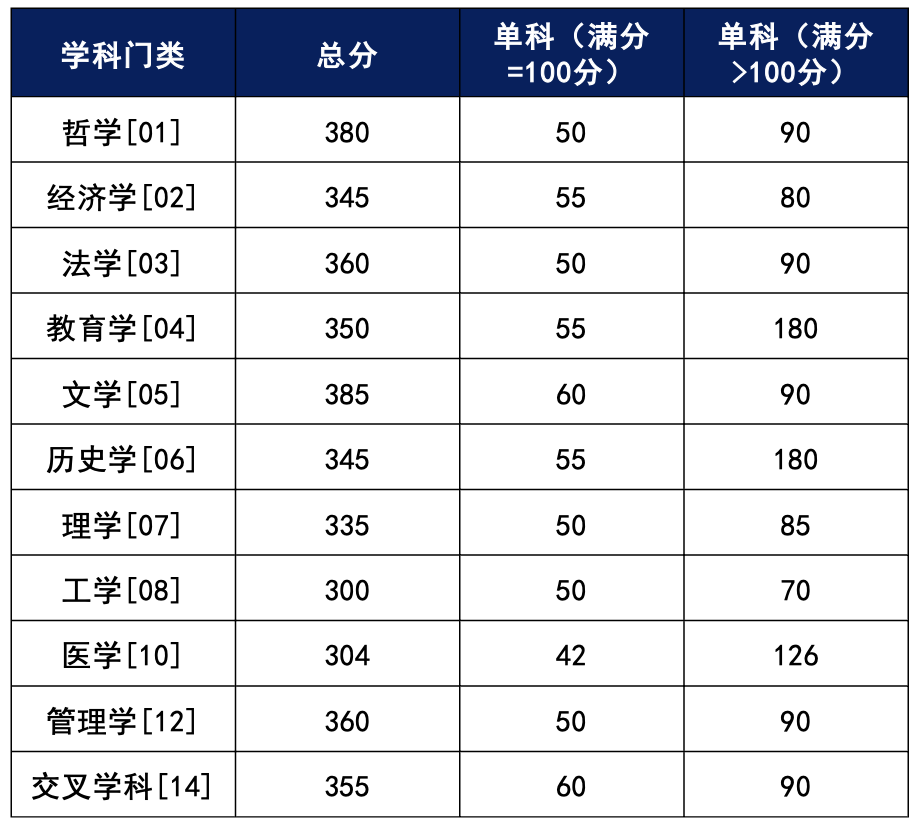
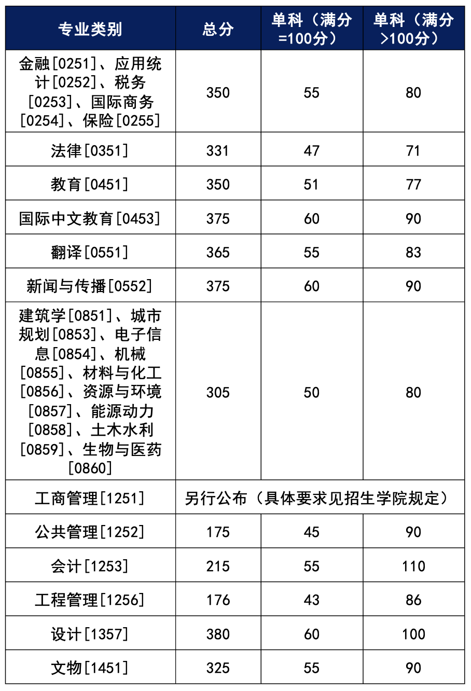
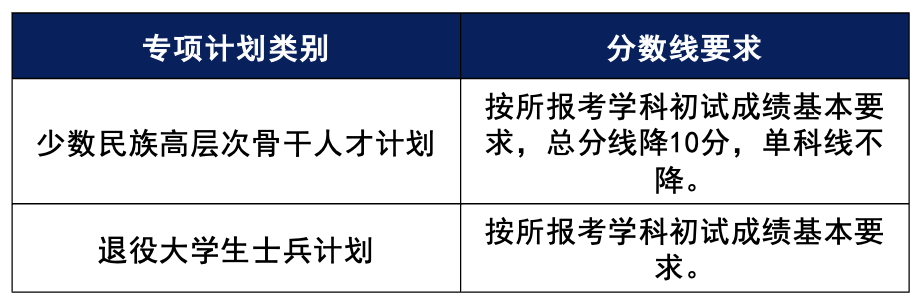

# 2024年湖南大学研考分数线公布！

- 公众号：湖大有话说
- 作者：金榜题名的
- 日期：2024-03-19
- 原文：https://mp.weixin.qq.com/s?src=11&timestamp=1790358599&ver=6988&signature=nGNZgjFcvYQZjkjASEXVfhV30tN1tKyEaxzsjsMFP98eHd0bNb1NRv8rhNd1Dy5f9i8lm2*7IgX4hKHmXeB0MRvMz2mSAxNGA7-ysUzM6c2HeYA84zsxH5YdaPMi5j9J&new=1

湖南大学

2024年硕士研究生招生复试基本分数线

正式发布

经学校招生工作领导小组研究决定，湖南大学2024年硕士研究生招生考试进入复试的初试成绩基本要求如下：

一、学术学位初试成绩基本要求

[图片]

二、专业学位初试成绩基本要求

[图片]

三、专项计划初试成绩基本要求

[图片]

四、其他

1.学校分数线是考生参加复试的基本成绩要求。学院可在不低于学校分数线的基础上，根据招生计划和生源情况，确定本学院考生进入复试的初试成绩要求。考生初试成绩须达到学院复试要求，才能进入复试。

2.按教育部规定可享受初试总分加分政策的考生，须在网上报名时按要求填报相关信息。网上报名时已按规定申报的考生于3月21日前向湖南大学研究生院招生办公室提出书面申请，并提供相关证明材料。

3.工作单位和户籍在国务院公布的民族区域自治地方，且定向就业单位为原单位的少数民族在职人员考生，可在相应学科分数线基础上总分降5分或一门单科降5分。网上报名时已按规定申报的考生于3月21日前向湖南大学研究生院招生办公室提出书面申请，并提供相关证明材料。

4.我校2024年原则上采用现场复试方式，预计于3月下旬陆续开展，具体复试安排以学院发布的复试实施细则和复试通知为准。请各位考生关注我校研究生院和学院网站通知，提前合理安排时间，做好复试准备工作。

附件详情请点击阅读原文链接

Via | 湖南大学研究生院

想要更及时获取湖大资讯

可以将“湖大有话说”公众号设为星标哦！

也可以添加墙墙微信获取各类校园通知哦~↓

墙墙微信：HNU1022

[图片]

## 图片

