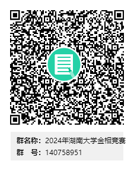

# 关于举办2024年度湖南大学大学生金相技能竞赛暨第十三届全国大学生金相技能大赛选拔赛的通知

- 公众号：湖大有话说
- 作者：分享湖大资讯的
- 日期：2024-03-23
- 原文：https://mp.weixin.qq.com/s?src=11&timestamp=1790358636&ver=6988&signature=nGNZgjFcvYQZjkjASEXVfhV30tN1tKyEaxzsjsMFP9*8Yzz*8ST0deA-0SFqfRkBKAb07a2y15ge75u*3qEZ0-pp7OpYXxRMLeMBsGPORWCdEIR1gG3-UQggppJDJRxG&new=1

全国大学生金相技能大赛是由教育部高等学校材料类专业教学指导委员会主办的全国性大学生赛事，每年定期举办。第十三届全国大学生金相技能大赛将于2024年7月在黄冈师范学院举行。为做好竞赛的组织和选拔工作，特举办湖南大学2024年度大学生金相技能竞赛暨第十三届全国大学生金相技能大赛选拔赛，现将竞赛有关事项通知如下：

一、组织机构

主办单位：教务处、学生创新创业中心

承办单位：材料科学与工程学院

二、比赛时间及地点

1.比赛时间：2024年4月21日（周日）

2.比赛地点：工程实验大楼250室（金相制样室）

三、比赛报名时间及方式

1.湖南大学在校本科生均可报名参加。

2.报名方式：

1）非材料学院的学生请填写报名表（见附件1）后电子版发送至wuluoyi@163.com。

2）材料学院拟参赛学生将填写好的报名表（见附件1）电子版报送本班学委汇总，各班学委按照报名学生学号顺序整理好报名表后，统一发送至wuluoyi@163.com。

3）联系人：吴老师（13975143736）比赛群QQ: 140758951

[图片]

3.报名截止时间：即日起至2024年4月8日18点前。

四、比赛时长及评分

1.比赛实际制样操作时间为35分钟。

2.比赛评分标准见附件3。

五、比赛奖励

比赛设一等奖10名、二等奖20名、三等奖30名，均颁发获奖证书。

六、其他

1.比赛用的材料、仪器设备等详见附件2。

2.其他未尽事宜，以具体通知为准。

附件：

1. 湖南大学2024年度大学生金相技能竞赛暨第13届全国大学生金相技能大赛选拔赛报名表

2. 湖南大学大学生金相技能竞赛实施细则

3. 湖南大学2024年大学生金相技能竞赛评分标准

教务处

学生创新创业中心

材料科学与工程学院

2024年3月18日

Via | 湖南大学学生创新创业中心

附件点击文末“阅读原文”获取

想要更及时获取湖大资讯

可以将“湖大有话说”公众号设为星标哦！

也可以添加墙墙微信获取各类校园通知哦~↓

墙墙微信：HNU1022

[图片]

## 图片

