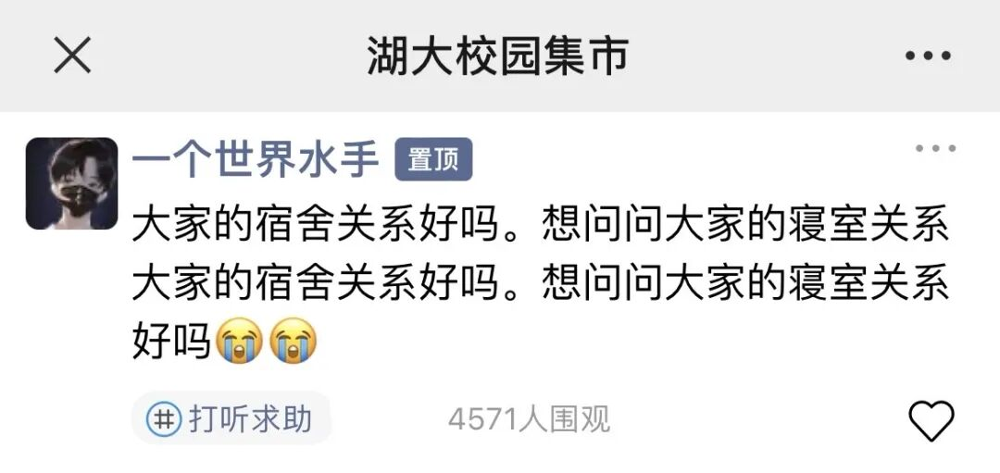
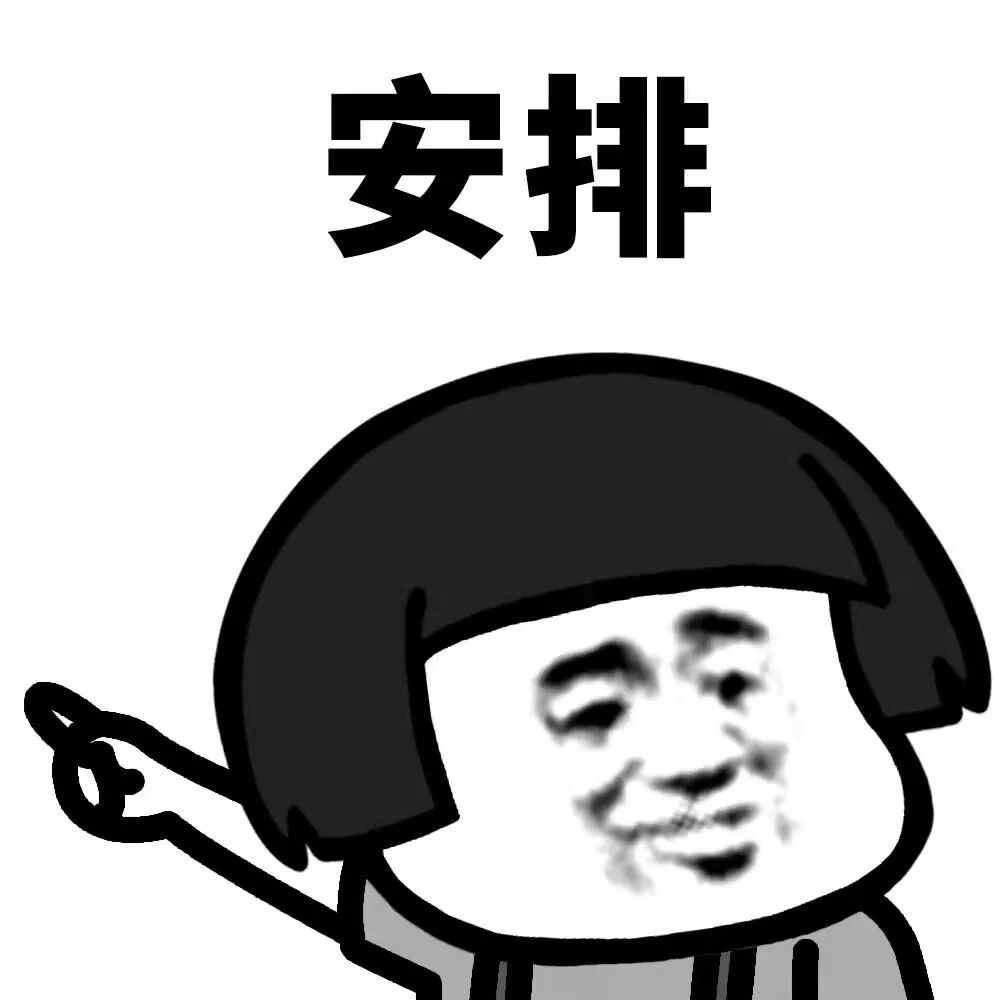
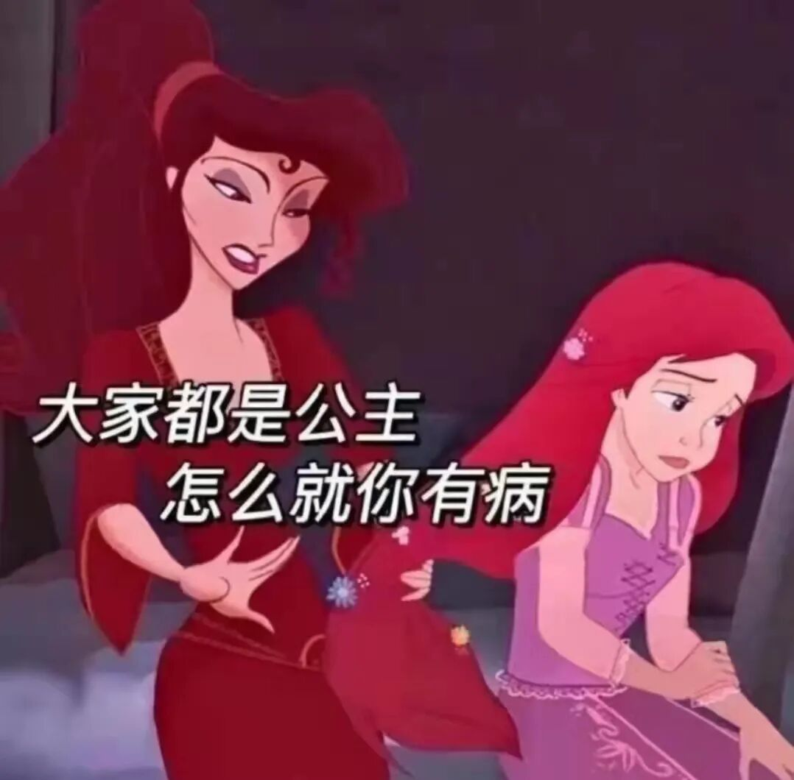
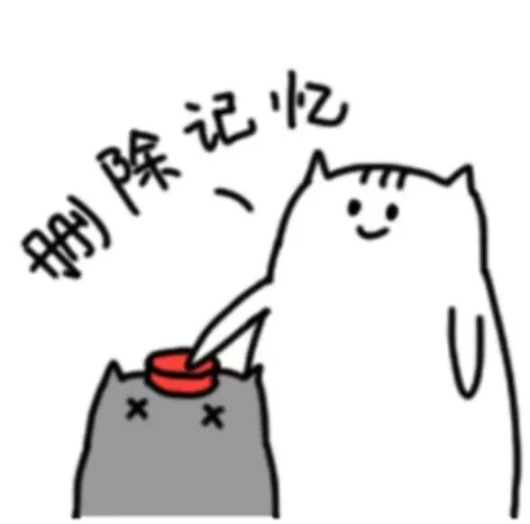

# 湖大宿舍不文明行为图鉴

- 公众号：湖大有话说
- 日期：2024-04-14
- 原文：https://mp.weixin.qq.com/s?src=11&timestamp=1790357539&ver=6988&signature=nGNZgjFcvYQZjkjASEXVfhV30tN1tKyEaxzsjsMFP99aobM5PoBzjYnj7avWmR9YS1fI9ZA66uD90zJwbop6MQhqics9jHz5FLFZ5QMcqn*kJ73S4zgz9CAUhcfDjz3*&new=1

[图片]

关注我们，玩转湖大

[图片]

相聚是缘

能分到一个寝室更是一场缘分

但因我们的生活习惯不同

对待问题的角度不同

久而久之

难免会产生摩擦

发生矛盾

很多uu都有和这位同学

一样的疑问

[图片]

大多数寝室关系的破裂[图片]

都是由于一些

难以忍受的行为习惯造成的

今天

就和墙墙来理一理

宿舍那些令人厌烦的行为！

[图片]

1

深夜扰民

总喜欢深夜煲电话粥

连麦打游戏

声音还特别大

“宝贝，不要生气嘛

我自己惩罚自己”

熄灯之后

闭上眼睛

耳边传来的都是舍友和ta对象的“恋爱循环”

还有各种腻歪的声音

[图片]

或者“打野怎么不帮忙抓人啊”

“集合集合，快来这”

“鸡蛋、鸭蛋、荷包蛋”

“我的小啾啾”

半夜打游戏我没意见

但咱能不能不连麦或者开语音啊？！

知不知道会影响别人啊

虽然在我提醒之后

舍友声音会小一点，但是......

几分钟之后

历史又会重演了......

留给我的只有绝望

[图片]

2

柠檬精

看到别人在学习

就阴阳怪气讽刺人家

嫉妒心在作祟

“哇，卷王在学习，怎么天天都这么卷啊”

“哪像我们

天天就知道玩

人家又要去图书馆学习了”

“还有两周才考试

怎么现在就开始复习了啊

这是要拿国奖的节奏啊”

“今天怎么没去图书馆学习？肯定是都学完了”

大家身边应该都有这种

自己不爱学习

看到别人学习还喜欢冷嘲热讽的人

这就是自己不想做还不想让别人做

[图片]

3

好吃懒做

经常就躺在床上

什么事情都让室友帮忙干

（从床上探出一个脑袋）

“你要去吃饭吗？

可以帮我带一个吗？”

然后还不自觉给钱

从来不主动打扫宿舍卫生

总是要舍友提醒了也假装没听见

这种真的是令人气愤！

偶尔一两次

大家都很乐意帮忙的

自己可以做到的事情

却要屡次麻烦别人

这样就很过分了！

[图片]

4

搞得整个床铺都在震

有的人真不知道有多大的力气

上个床好像要把宿舍掀翻一样

声音巨大

连隔壁床铺都能听见响动

晚上睡觉翻个身

感觉像地震一样

天天这样

我真的会精神衰弱的！！

[图片]

5

顺手牵羊

无需自行购买

只需“借”舍友的

什么都想借

一包纸都要借

连梳头的梳子都要借

你是有多穷

有的东西，借多了，借久了

那就不叫借了，是拿！

[图片]

6

没有边界感

没有经过别人同意

就乱翻别人东西

每个人都有自己的隐私

都不希望自己的东西

在没有经过本人同意的情况下

被任何人翻动

有的人总喜欢看别人干什么

干什么都喜欢盯着别人

你是没有自己的事做吗

在身边嗡嗡嗡的

还动手随便翻东西

这是很令人讨厌的行为

[图片]

7

公主病

宿舍的作息时间都要按照ta的来

不知大家身边有没有那种

ta睡了全宿舍都得睡

ta醒了全宿舍都得醒

每个人在家里都是宠儿

没有谁必须要迁就着你

不要太自以为是

公主病发作的太多了只会让大家讨厌

[图片]

8

闹钟狂魔

手机上十几个闹钟

但就是不起床

闹钟全是给室友听的

除了室友

没有任何东西能够把他唤醒

[图片]

最后

墙墙还是有几句话想说

如果你和室友确实合不来

那只需要做好自己就可以了

合群并不是一门必修课

可以自己一个人去图书馆看书

安静的同时还可以提升自我

很久以后你会发现

令人讨厌的舍友

不过是微不足道的一小小部分

甚至你会连TA的名字都记不清

[图片]

但如果你很幸运

遇到一群很合拍的舍友

要懂得珍惜

以后真的是一段很美好的大学回忆

像王树国校长宿舍那样的

今日话题

在寝室室友还有哪些行为让你难以接受呢？

欢迎评论区留言哦

[图片]

高校集市湖大微信群

扫码添加墙墙好友，

回复“集市”,自动邀请进群

[图片]

[图片]

— 推荐阅读 —

（点击蓝字即可阅读）

2024年考试日历

拿证！毕业特快班！

上岸 | 若你决定灿烂，山无遮，海无拦

湖南大学PPT模板大合集来啦~进来领取！
关于2024年本科学生转专业（专业类）工作安排的通知

【商务合作微信：HNU1022】

[图片]

## 图片

