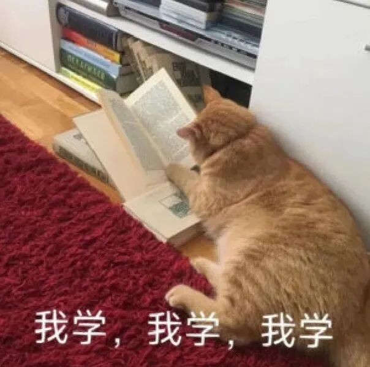
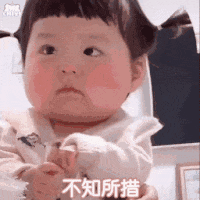
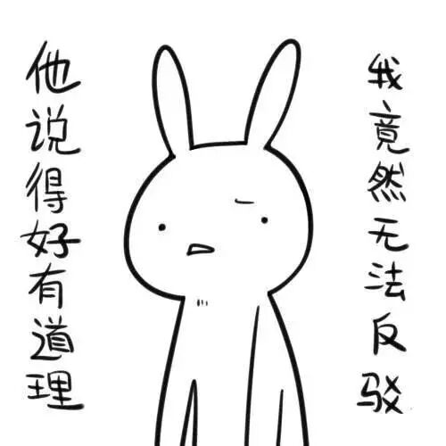
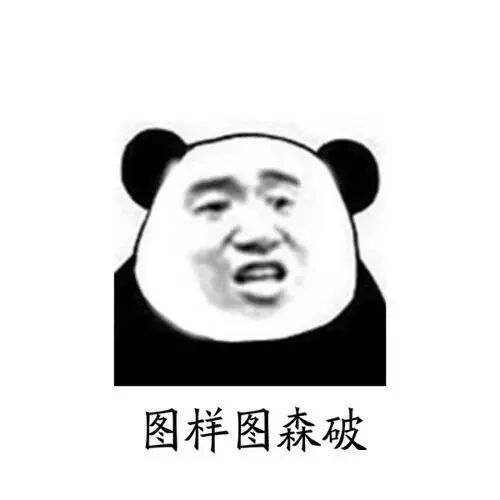
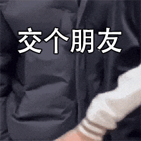
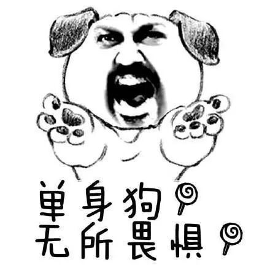
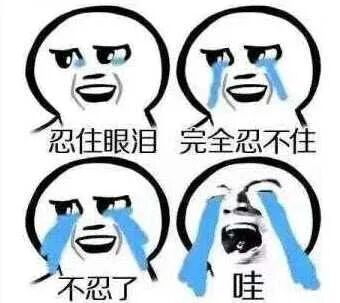
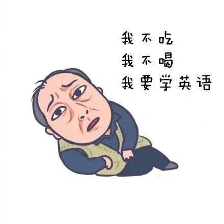
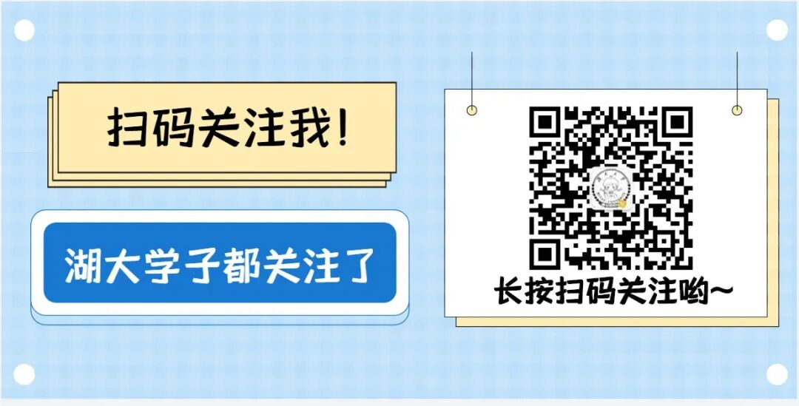

# 毕业倒计时！大学遗憾排行榜出炉！别让它发生在你身上！

- 公众号：湖大有话说
- 日期：2024-04-21
- 原文：https://mp.weixin.qq.com/s?src=11&timestamp=1790358592&ver=6988&signature=nGNZgjFcvYQZjkjASEXVfhV30tN1tKyEaxzsjsMFP9-726JqI2jct85vlInqqNwP6OAjJc3xYVBo9lPi5lQV6mHmjW9ziv9smMpojBOxUs5QNEjTTZbiHikrs6vOsQw8&new=1

“咔嚓”一声响起

学士服往身上一穿

大部分同学的大学生活就此画上了句号

虽然现在才4月

掐指一算

24届毕业生在校的时间

可能只有不到100天啦！[图片]

马上就要跟湖大说再见了

上课的教室、吃过的食堂、走过的绿道

再去好好看看

拍些照片留作纪念吧~

即将要毕业了

想问问各位毕业生们

你的大学生活有什么遗憾吗？

[图片]

NO.1

没有上自己理想的大学

@山高水长

感觉自己没什么遗憾，一定要说的话，大概就是高中不够努力，没去成自己很想去的那个学校，大一的时候几度想回高中复读，一直都没有下定决心，拖着拖着，四年就过去了。不过在这里也遇到了很多有意思的人，也算是入股不亏。

NO.2

没有好好学习

@四海八方

没有好好学习，争取到学校保研的机会。考研真的据说很难，把我吓得不敢考了哈哈......

@前程似锦

没有好好学习，在大一就挂了科。后面很多机会都因为挂过科丧失了。

[图片]

NO.3

没有好好规划自己的未来

@人间理想

从高中那种每天只为了一个目标奋斗的日子过渡到了丰富多彩的大学。没有想过自己要什么，未来该往哪条路上走，按照高中那种天天上课下课、完成作业的模式过完了大学。临近毕业了，突然不知道改怎么走上社会了。要说大学最遗憾的事，大概是没有早点找到自己的方向吧。

[图片]

NO.4

没有勇敢一点

@未来可期

在大学的时候遇见了一个很喜欢的人，但是他太优秀了，哪怕我在拼命的好好学习，努力的想让自己变的更好，也一直没有鼓起勇气去接近他。毕业好几年了，有时候还会想起他，还是会怪自己当初怎么不勇敢一点。

@意气风发

太自卑了吧，不管干什么都迈不出第一步。想参加的比赛没有勇气报名，想进学生会不敢去面试，好的机会摆在眼前不敢去争取.......现在也还是这样，因为这样的性格真的失去了太多了，多希望自己可以勇敢一点。

[图片]

NO.5

没有多出去走走

@风华正茂

大学的时候，身边没有朋友，自然不可能找到人和我一起旅行，爸妈工作也很忙更不可能陪我出去。

直到考研之后为了见在网上认识的一位朋友，才第一次自己长途旅行去了广州，那一次真的让我看到了一个人旅行可以很快乐。

然而，这一次来得太晚了。随之而来的是上了研究生，虽然有了身边的好朋友，但是所有的课程考试都是假期写论文，寒暑假早已名存实亡，而且在可预见的未来里更不会再有像大学的寒暑假那样完全属于自己的时间了。

[图片]

NO.6

没有交到很好的朋友

@无可替代

四年大学飞快的就毕业了，工作了才发现一个在联系的大学同学都没有。上学的时候好像真的没有很用心的去交朋友，大家都维持着表面的关系。当时觉得没什么，现在想想挺遗憾的，连个和自己一起回忆大学生活的人都没有了。

[图片]

NO.7

没有谈一场恋爱

@乘风破浪

大概是没能够谈一场恋爱吧。导致现在的我听着儿时玩伴谈婚论嫁觉得很不真实，甚至有点搞笑。我连蓝孩子的小手都没有牵过，嗯，听你们一起商量婚礼应该注意的地方。

@逐梦扬威

如果你们现在正在上大学请好好认认真真地谈一场恋爱。这是来自母胎单身的老学姐的真心的建议。没有在最好的年纪被一个人不顾一切全身心的爱过，也没有不顾一切全身心的爱过一个人，我觉得这是一种遗憾。

[图片]

NO.8

因为谈恋爱放弃了太多

@怦然心动

最遗憾的事情，就是在最有时间和精力的年龄，光顾谈恋爱，没好好读书。

@纸短情长

谈了恋爱之后世界了就只有他了，社团不去了，各种活动不参加了，也没有朋友。我整天围着他转，圈子变得越来越小。分手了之后，觉得天都塌了。花了很长的时间才走出没有他的世界，回归到正常的大学生活，现在想起来真的很遗憾，不管什么时候，我们都应该有自己的生活，为了别人而活太可怕了。

[图片]

NO.9

没有和喜欢的人走到最后

@轰轰烈烈

和她分手。我比她早一年毕业，还在一起的时候我就决定去西部，她不太同意，我却一意孤行。毕业前夕闹矛盾分手，我离校前去找过她，却没能挽回。我感到整个世界都是灰暗的。毕业后去了西藏。一个多月后，我人已经在西藏，她打电话给我，说忘不了我。我哭的稀里哗啦。又在一起了。可惜最后还是分了。都说陪伴是最长情的告白，直到那时我才懂。可说什么都晚了。

和她分手是我人生中最大的遗憾。

[图片]

NO.10

没有好好学英语

@塔尖辉煌

我最遗憾的是，我没有好好学英语。考研让我自己看清了自己，希望还不晚，未来三年好好努力。

@诸事顺遂

四级没有过。碰到几个心仪的工作，都对四六级有一定的要求。还好最后也找到了不错的工作，不然我可能得后悔死。

[图片]

不要让遗憾停留

抓紧去做你想做的事情吧~

人生没有彩排

每天都是直播

今日话题

你还有什么遗憾呢？

或者尚未毕业的学弟学妹们

有什么想对学长学姐说的

欢迎评论区留言哦

高校集市湖大微信群

扫码添加墙墙好友，

回复“集市”,自动邀请进群

[图片]

[图片]

— 推荐阅读 —

（点击蓝字即可阅读）

2024年考试日历

拿证！毕业特快班！

上岸 | 若你决定灿烂，山无遮，海无拦

湖大毕业生攻略丨签三方协议要注意什么？请查收问答大全！

湖南大学PPT模板大合集来啦~进来领取！
关于2024年本科学生转专业（专业类）工作安排的通知

【商务合作微信：HNU1022】

[图片]

## 图片

