# 昨晚，我们被骗了......

- 公众号：湖大有话说
- 作者：连夜爆肝防诈攻略
- 日期：2024-04-29
- 原文：https://mp.weixin.qq.com/s?src=11&timestamp=1790358588&ver=6988&signature=nGNZgjFcvYQZjkjASEXVfhV30tN1tKyEaxzsjsMFP9*waaSxzs65FiePT33i1ojk6u7w46yqfgf8GjiJqnCoOsC-qsCS3-5-FzHFzG2NHNxgAZ3Bo76qYs1FjjgSm1rR&new=1

大家好，我是你们笨笨的墙墙。

事情的经过是这样的[图片]......

4月23日墙墙公众号发布了五一抽奖活动（活动详情点击蓝字可查看），其中设置的一等奖为520元现金一份，并在推送中注明参与条件需是湖南大学在籍学生。4月28日中午12点开奖后半小时，一等奖“获得者”添加墙墙微信并备注“23电子商务李艺杰领奖”来兑奖，墙墙按照流程要求其出示兑奖码、学生证明等相关截图。以下是聊天截图。

[图片]

[图片]

[图片]

[图片]

左右滑动查看

七点墙墙准备转账时，微信提示有异常（图源网络，是这样的，当时忘记截图了）。连续两次转账提示都是如此。

[图片]

于是墙墙进一步要了这位同学的身份证照片、学信网截图和个人门户截图。信息看起来都对得上。后面墙墙想再尝试一下看看会不会有风险提示，结果转账成功了。后续这位同学也发来了数字校园卡截图（这个是要有校内账号才能登录的）。墙墙悬着的心才算放下了。

[图片]

[图片]

[图片]

[图片]

左右滑动查看

没想到放下的太早了（悬着的心终于死了）

[图片]

就在发布了中奖情况公布的推送后没几分钟，评论区以及后台就收到好几条留言说23级电商并没有叫李艺杰的同学。

[图片]

于是墙墙赶紧联系这个同学，看是不是什么地方搞错了，但是，如各位所想，这位同学已经不回消息了。（土拨鼠尖叫！！！！）

[图片]

[图片]

[图片]

左右滑动查看

由此得出结论，这是遇到骗子了。

[图片]

有人会问，为什么可以确定他是一等奖获得者，因为中奖者都会有一个专属二维码，墙墙核销过了，确实是ta没错，只是ta并不符合中奖条件，所以ta在得知自己中奖后，连忙伪造了以上“身份信息”，并且细节到手机上的时间都是实时时间。事已至此，墙墙只能躲被窝里哭了呜呜呜

[图片]

校园卡、身份证、学信网和电子校园卡都备上了，这样准备充分的骗子真是令人防不胜防。只能吃一堑再吃一堑了。

[图片]

感谢给墙墙出主意、安慰墙墙，还给发转账找回攻略的小可爱们，你们真是太贴心了呜呜，墙墙好感动，世界还是好人多啊（墙爆哭！！）

更多评论可以加墙墙朋友圈查看：HNU1022

[图片]

[图片]

[图片]

[图片]

[图片]

[图片]

左右滑动查看

不过有福同享，有难同当，建议大家每人v墙墙50也来吃一堑（bushi）。

[图片]

秉持着“被骗也要被骗的有意义”原则（来都来了），墙墙决定现身说法，勇当反面教材，给大家做一期防诈骗小攻略。

[图片]

首先，最近毕业季了，二手群等校内交易也开始变得活泛起来，尽管二手群进群的时候会有管理员审核学号和专业，但是还是会有漏网之鱼，防不住“有心人”，大家在交易的时候也要注意辨别，最好最好是线下交易，务必在校园内一手交钱一手交货，切勿提前给钱，尤其是一些数码产品或者电动车之类金额较大的物品。

另外大家也可以通过查看对方主页（是否小号）、空间或朋友圈（是否开放）、对方在群内聊天记录（是不是一直重复发一样的内容）的方式进行初步判断。

[图片]

（图片来自二手群群公告）

如遇到只能线上交易的情况，大家在核实对方身份信息时，可以采取视频录制（录屏）的方式查看对方校园卡等证明（像以上这样全是截图的话也很容易被钻空子！！P图啥的！！）

其次，大家想要兼职的话，也要擦亮眼睛。群内现在很多“日结150”、“淘宝p图，一张25”之类的消息，这些绝对绝对绝对是假的，哒咩哒咩！还有教学楼偶尔会出现的校内勤工助学传单（学校的勤工助学中心不会发这种传单的！）

[图片]

如果是想要做家教，能直接和家长对接就更好，或者找熟人介绍，不能的话也尽量找正规的中介机构，小心高额信息费。

最后分享一下前天学校官微刚发的防诈宣传推文（点击图片进入）

[图片]

希望大家都能远离诈骗，和谐生活。

[图片]

大家还遇到过什么骗局

欢迎在评论区补充

一起避坑!

[图片][图片]

想要更及时获取湖大资讯

可以将“湖大有话说”公众号设为星标哦！

也可以添加墙墙微信获取各类校园通知哦~↓

墙墙微信：HNU1022

[图片]

## 图片

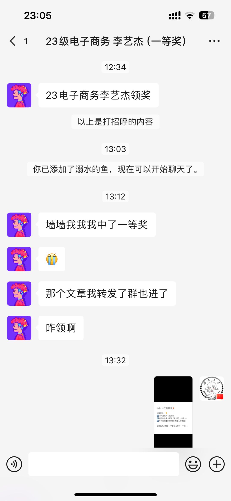
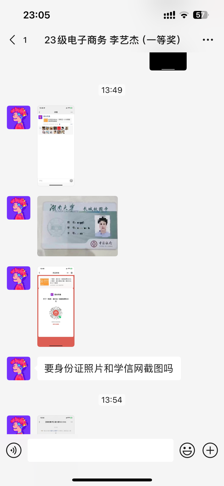
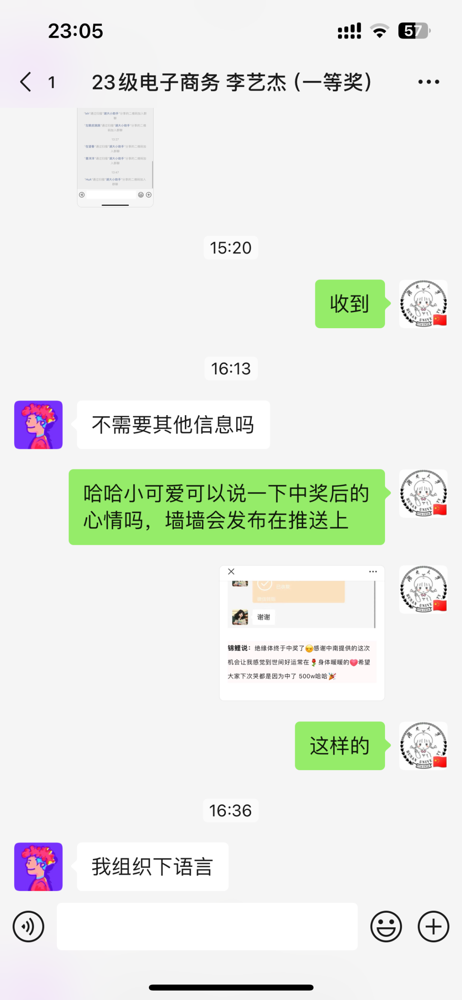
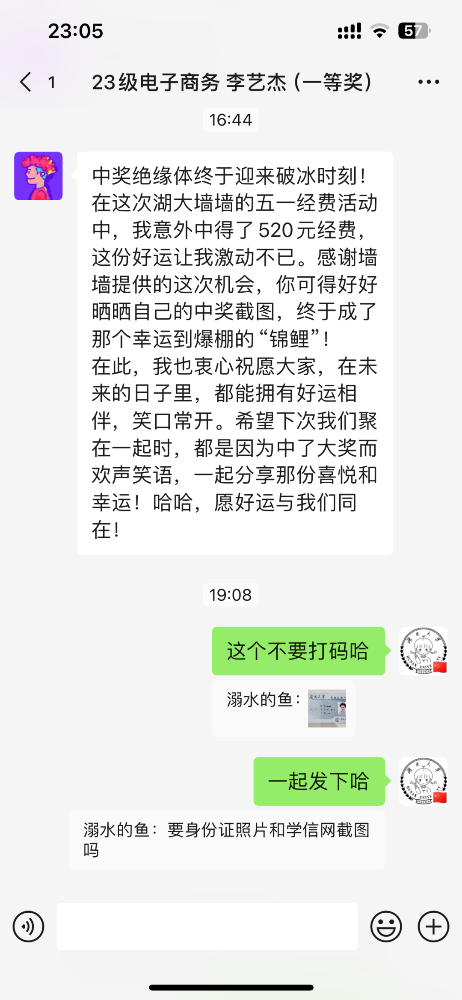
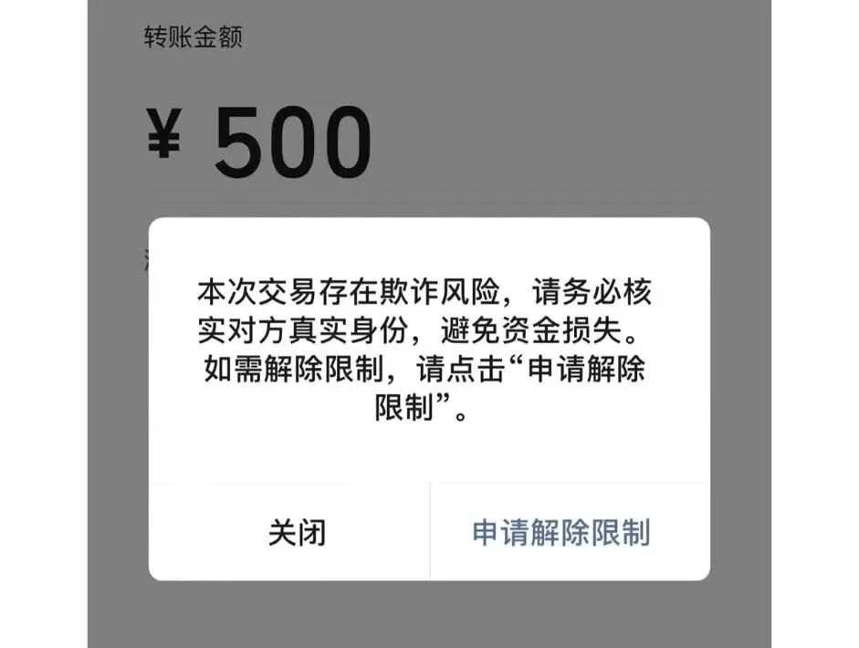
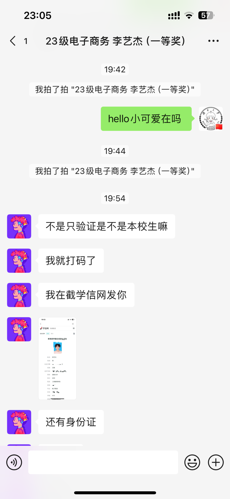
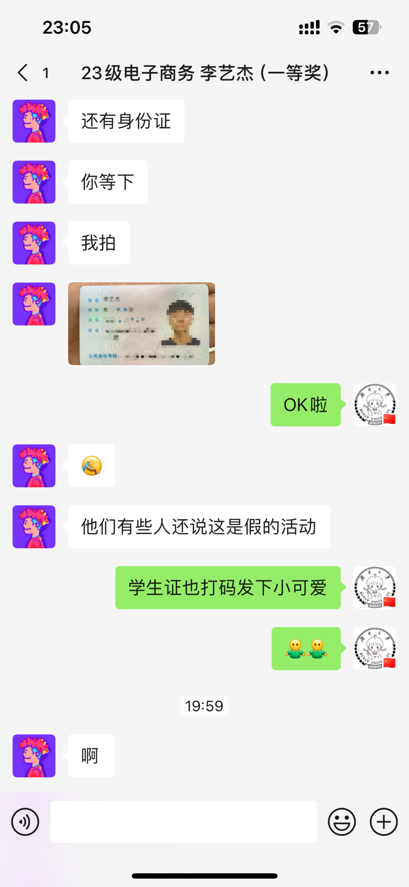
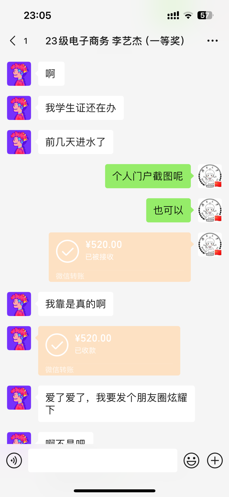

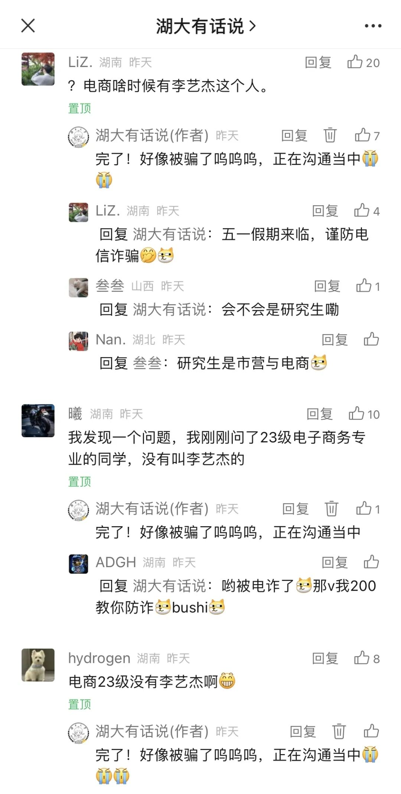
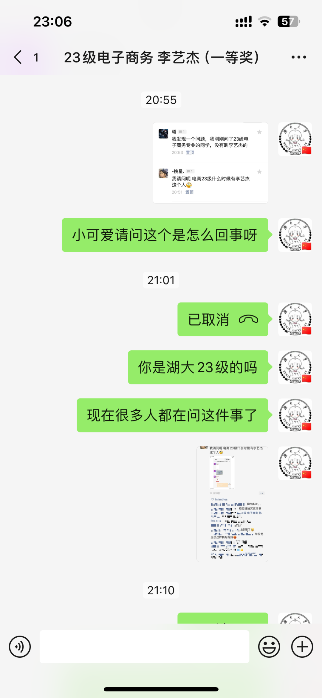
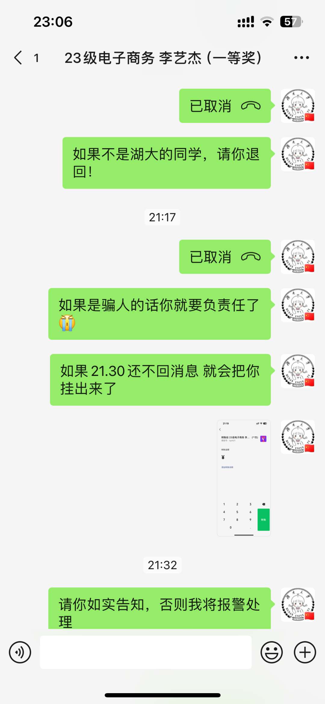
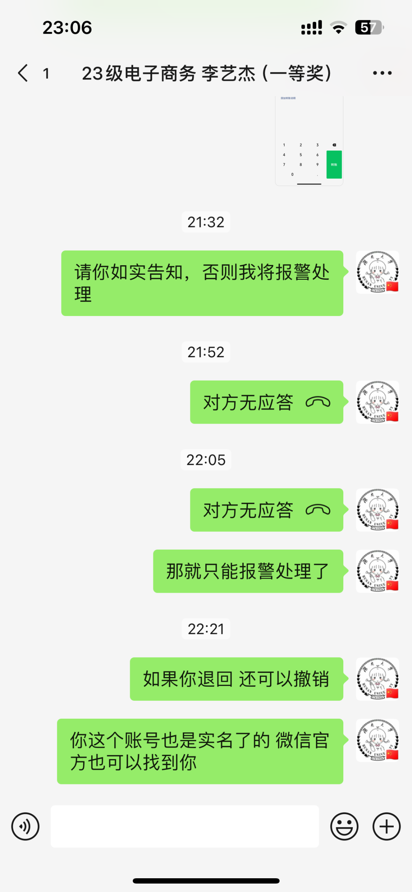

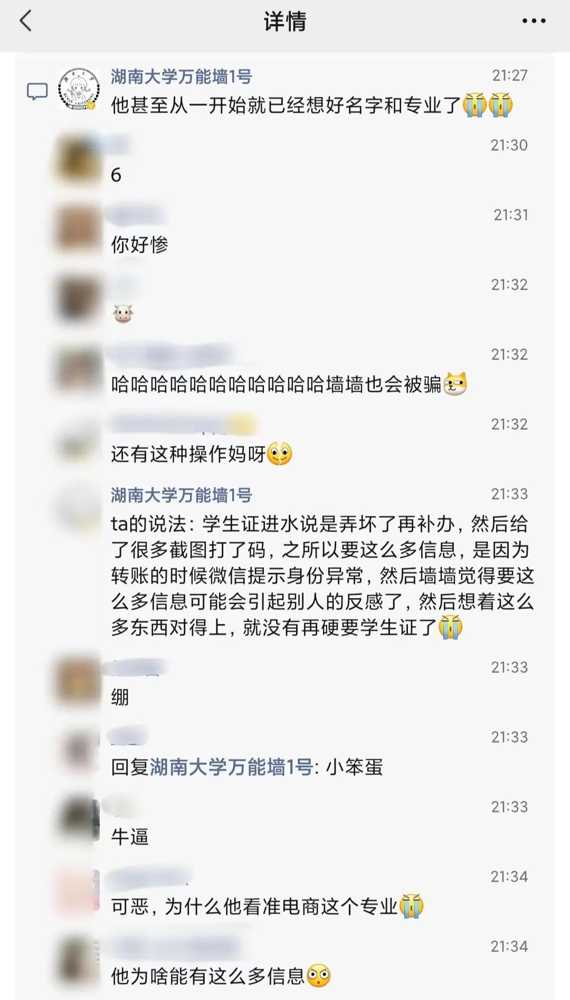

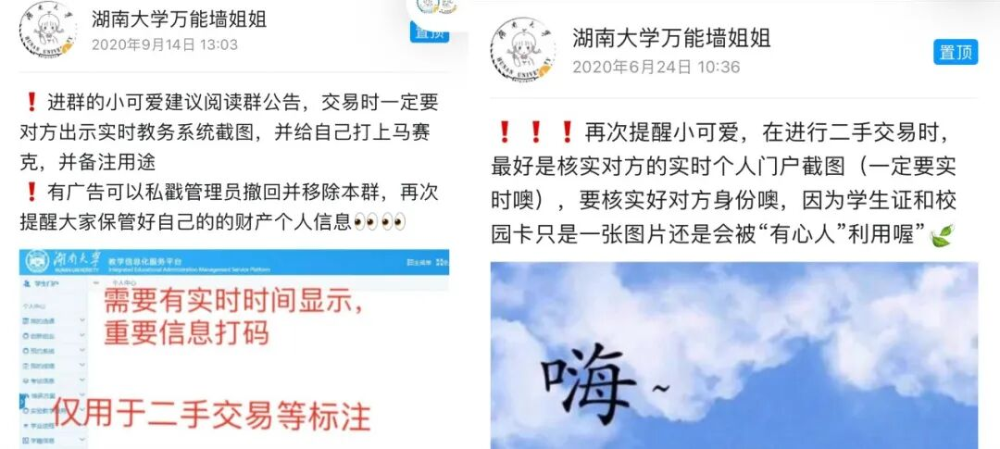
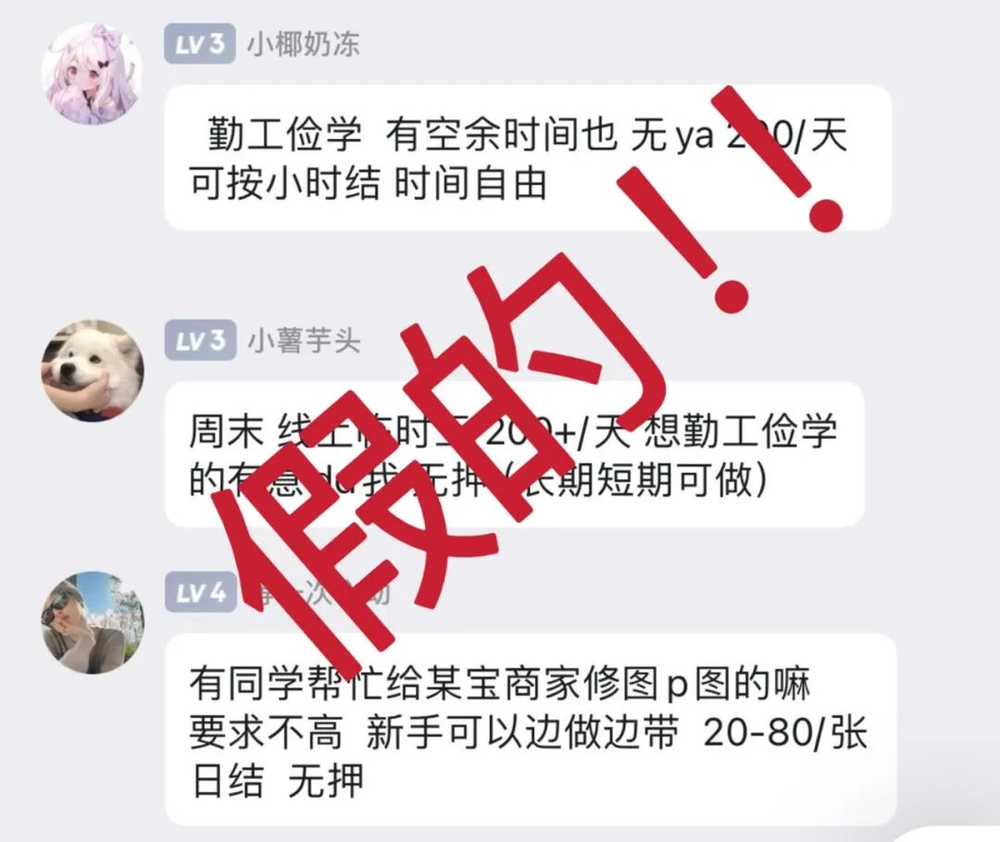

