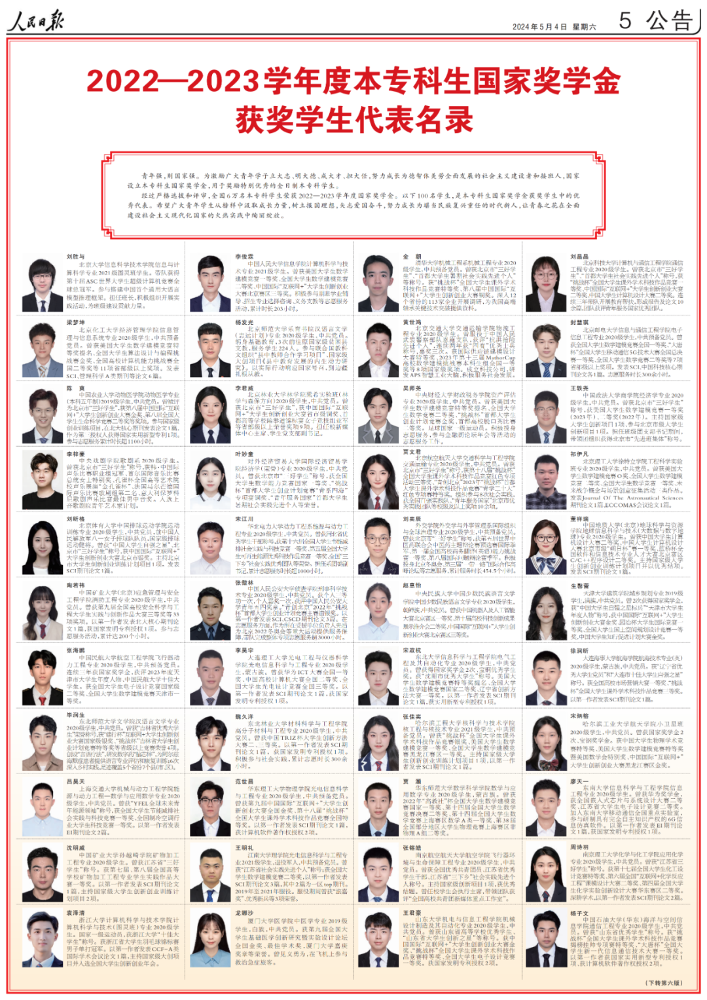
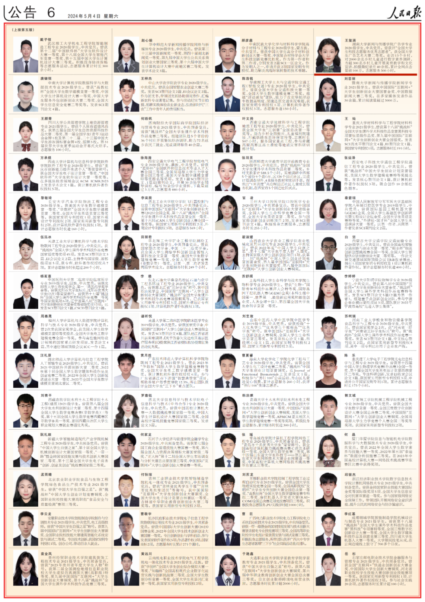
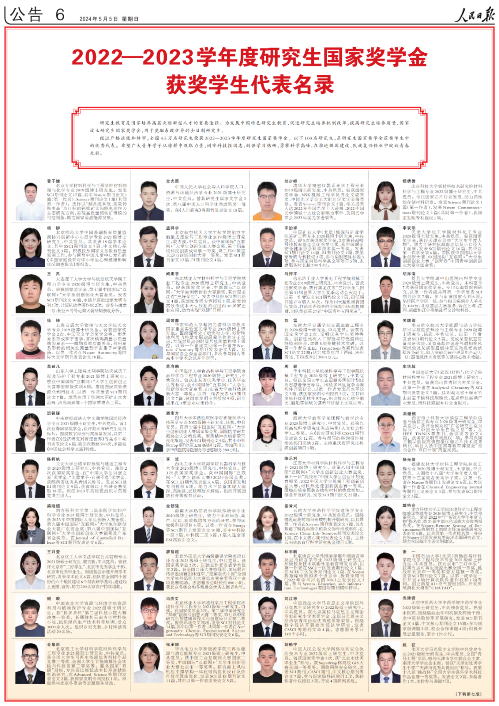
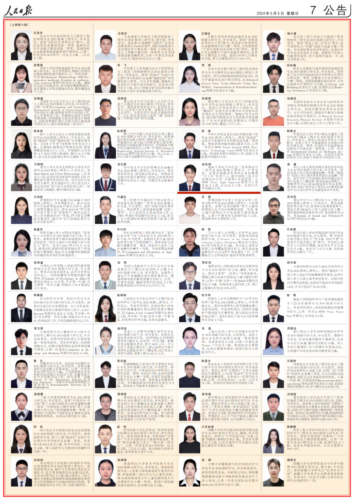

# 王玺涵同学、翁廷坤同学入选《人民日报》国家奖学金获奖学生代表名录

- 公众号：湖大有话说
- 作者：湖大学工
- 日期：2024-05-05
- 原文：https://mp.weixin.qq.com/s?src=11&timestamp=1790358592&ver=6988&signature=nGNZgjFcvYQZjkjASEXVfhV30tN1tKyEaxzsjsMFP983EcAsbj1nLfE43CbtunlX8BP2mEsAs50bGrhgHnYtoJpYTOxlcNv9erAV0f269wmYFhowXPFku3oGTmOYC0kN&new=1

5月4日、5日，《人民日报》刊发2022-2023学年度国家奖学金获奖学生代表名录，我校新闻与传播学院广告学专业2020级本科生王玺涵、电气与信息工程学院电气工程专业2021级硕士研究生翁廷坤分别入选本专科生国家奖学金获奖学生代表名录、研究生国家奖学金获奖学生代表名录。

[图片]

★

王玺涵

★

王玺涵，湖南大学新闻与传播学院广告学专业2020级学生，中共党员。曾获评"全国大学生科技志愿服务优秀志愿者"。获全国大学生广告艺术大赛二等奖。走访13个乡村，对2000余名乡村儿童进行数字素养调研，为超300名乡村儿童开展美育教学和文化宣讲，拍摄微纪录片40余部，累计全网点击量破100万。志愿服务300小时。

[图片]

★

翁廷坤

★

翁廷坤，湖南大学电气与信息工程学院电气工程专业2021级硕士研究生，中共党员。曾获评湖南省优秀毕业生和暑期"三下乡"先进个人，获中国电工技术学会最佳论文奖、互联网+全国银奖。在IEEE Trans. Appl. Supercon等期刊上发表论文2篇、会议论文3篇。获国内外专利授权6项。

《人民日报》刊登的100名本科专科生国家奖学金获奖学生代表、100名研究生国家奖学金获奖学生代表是全国6万名2022-2023学年度本专科生国家奖学金获得者中、4.5万名2022-2023学年度研究生国家奖学金获得者中的优秀代表。我校获奖学生代表已连续七年入选《人民日报》获奖学生代表名录。

[图片]

[图片]

2022-2023学年度本专科生国家奖学金

获奖学生代表名录

[图片]

[图片]

2022-2023学年度研究生国家奖学金

获奖学生代表名录

来源 | 湖大学工官微

[图片]

想要更及时获取湖大资讯

可以将“湖大有话说”公众号设为星标哦！

也可以添加墙墙微信获取各类校园通知哦~↓

墙墙微信：HNU1022

[图片]

## 图片

