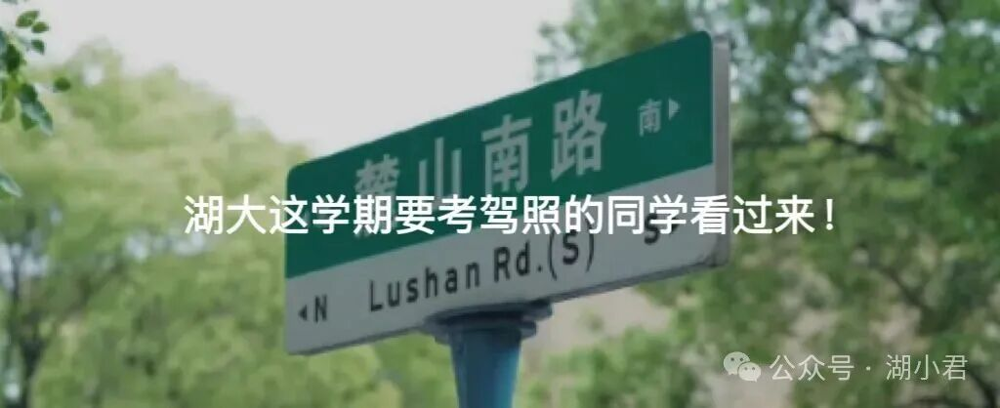

# 湖大竞赛通知一则

- 公众号：湖大有话说
- 作者：分享湖大资讯的
- 日期：2026-03-13
- 原文：https://mp.weixin.qq.com/s?src=11&timestamp=1790357603&ver=6988&signature=nGNZgjFcvYQZjkjASEXVfhV30tN1tKyEaxzsjsMFP980i73vqCwMdBqaRErnlPDMjHMdZTTdLMy3JUBhHiXwpvovEk7c0ASs4DOcle9gOGBhDnYouukhmky5vkMZuSeP&new=1

[图片]

关于2026中国大学生计算机设计大赛湖南大学初选的通知

各相关学院：

中国大学生计算机设计大赛是我国高校面向本科生最早的赛事之一，是全国普通高校大学生竞赛排行榜榜单赛事之一。该赛事始创于2008年，至今已举办了18届。2026年（第19届）中国大学生计算机设计大赛即将开赛。

一、比赛目的

本次比赛的目的是为了全面提高教学质量，切实提高计算机教学水平，激励大学生学习计算机知识、技术、技能的兴趣和潜能，培养其创新创业能力团队合作意识，提高大学生运用信息技术解决实际问题的综合实践能力。向“2026年（第19届）中国大学生计算机设计大赛”中南地区赛及国家级竞赛推荐优秀选手和作品。

二、大赛分类

2026年大赛分设11个大类，分别是（1）软件应用与开发，（2）微课与AI辅助教学，（3）物联网应用与物联网创新转化（创业实践），（4）大数据应用，（5） 人工智能应用，（6）信息可视化设计，（7）数媒静态设计，（8）数媒动漫与短片，（9）数媒游戏与交互设计，（10）计算机音乐创作，（11）国际生“汉学”（“中华优秀传统文化”数智创作）。每个大类下设若干小类。详细分类见附件1。

2026 年大赛的（6）至（11）共 6 个大类作品主题的是“中国古代建筑成就——中华优秀传统文化系列之六”，内容包括民居、官府、皇宫、桥梁，不含庙宇、宝塔，时间限在1911 年以前。参赛作品若使用 AI 工具，则需采用大赛组委会指定的15 款国产免费AI 工具（每年动态调整一次，2026 年的 AI 工具列表参见附件 4），或采用拥有自主知识产权的AI 工具。

三、大赛对象

大赛参赛对象是2026年在籍本科生。

四、大赛时间、指标及报名要求

1.指标：大赛分为校级赛、省级赛、国家赛三个级别，依次晋级参加。推荐到省赛时，每个小类作品数不超过附件1的要求，各小类作品数的总和不超附件1所列的该大类的作品上限。学校没有推荐的作品不得直接上报省赛或国赛。

2.费用：学生费用由学生所属的学院负责，指导教师的费用由教师所属的学院负责。

3.报名方式：

大赛只接受团体报名，每个参赛队由2-9名学生组成，每队可设指导教师1-2人，每队只能提交一个参赛作品，每位作者在每大类只能提交1件作品。

（1）按“中国大学生计算机设计大赛”作品及资料格式相关要求，在中国大学生计算机设计大赛报名系统“湖南大学”中提交竞赛作品与相关资料。

（2）作品及资料提交方式：登录大赛报名系统后，在系统中选择“湖南大学校赛2026”提交，最新要求请参阅大赛网站。

（3）作品及资料提交时间：2026年4月20日前。在线完成报名后，参赛队需要在报名系统中下载打印由报名系统生成的报名表，全体作者签名后，在2026年4月20前提交给信科院李小英老师。

（4）大赛信息发布网站网址：https://jsjds.blcu.edu.cn/，大赛报名及作品上传网址：https://2026.jsjds.com.cn/account/

咨询竞赛相关信息请到QQ群咨询，QQ群号：1018960138 。学校经过评审后，选择优秀作品推荐参加中南地区赛。

联系人：湖南大学计算机学院 李小英老师，联系电话：18173124816，QQ：470595755。

附件1：4C2026大赛通知(发布版)

附件2：(2026)中国大学生计算机设计大赛中南地区赛竞赛组织委员会通告

计算机学院

学生创新创业中心

2026年3月12日

Via | 湖南大学学生创新创业中心

[图片]

有问题想请大家帮忙出主意？

想看看湖大的瓜田趣事？

有闲置物品想要出掉？

想找到喜欢的那个Ta或者结交更多朋友？

有需要跑腿接单？

那就锁定湖大校园集市吧

[图片]

[图片]

往期推荐👇

大学，有秋假了！

关于申报2026年湖南大学卓越人才出国交流资助（本科生）的通知

湖南大学普通话考试通知

低至99元！开学季配镜福利——可送眼镜清洗机！

2026学车优惠｜湖大要考驾照的同学看过来！

[图片]

## 图片

