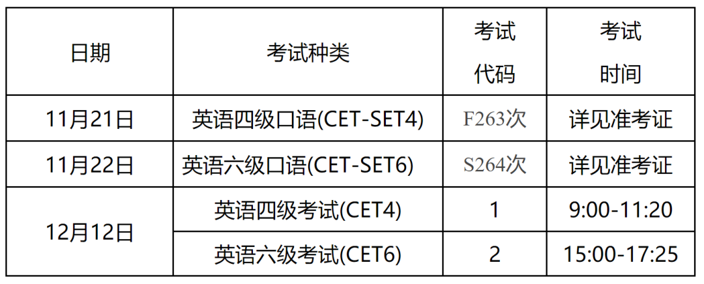

# 湖南大学四六级报名通知

- 公众号：湖大有话说
- 作者：分享考试资讯的
- 日期：2026-09-12
- 原文：https://mp.weixin.qq.com/s?src=11&timestamp=1790357539&ver=6988&signature=nGNZgjFcvYQZjkjASEXVfhV30tN1tKyEaxzsjsMFP99Z7HaMjLEaLhgm*RQ0QNns35zN7elJbgnO79CSNIYApmK1TSrwujtnYxRYnPkSHE05XgMd6dYRDsqpd3Q2KAi9&new=1

关于2026年下半年全国大学英语四、六级笔试考试和口语考试报名通知

各学院，各位同学：

根据统一安排，2026年下半年全国大学英语四、六级考试（CET）和口语考试（CET-SET）即将开始报名，现将有关事项通知如下：

一、语种级别及考试时间

[图片]

二、报名条件

1.我校在籍本科生、研究生；

2.报考四级无其他条件限制，报考六级需要四级历史最高成绩达到425分（包括425分）；

3.英语四级与六级不兼报；

4.2026年上半年大学英语六级考试缺考者本次停报；

5.口语考试禁止跨校报考；

6.完成本次CET4笔试报名后可报考CET-SET4，完成本次CET6笔试报名后可报考CET-SET6；

7.四级、六级考试均开放校内最大考场容量，报满为止。

三、报名时间

本次报名分两个阶段进行。

第一阶段：9月14日12:00至9月16日9:00，此阶段仅对未报名参加过CET6考试的本科生，以及CET6考试成绩未达到425分的本科毕业生开放;

第二阶段：9月16日13:00至9月21日16:00，此阶段对我校符合报名条件的全部考生开放。

四、收费标准（湘发改价费[2023]468号）

1.四级:26元/人

2.六级:28元/人

3.CET-SET：50元/人

五、网上报名、缴费及相片要求

1.考生自行登录考试报名网http://cet-bm.neea.edu.cn进行报名，个人信息确认、选择报考科目、网上缴费等报名手续；

2.网上缴费必须24小时以内完成，超过24小时缴费报名无效，须重新报名；

3.报名页面未显示照片的学生请将以身份证号命名的照片发送至指定邮箱277482882@qq.com。相片要求144像素×192像素（宽*高），大小6～10KB，相片的存储格式统一为：身份证号.jpg。

六、成绩报告单

为全面贯彻绿色节能环保发展理念，深入推进教育考试数字化转型，自2026年上半年考试起，CET将不再印发纸质成绩报告单。成绩发布10个工作日后，考生可登录中国教育考试网（www.neea.edu.cn）查看并下载电子成绩报告单，电子成绩报告单与原纸质成绩报告单具有同等效力。

七、其他事项

1.学校不提倡已通过考试的学生反复刷分，请尽量将考试机会让给更有需要的同学；

2.所有考生一律凭准考证和有效身份证件参加考试，证件不齐者禁止参加考试；

3.大学英语六级缺考的学生将停考一次大学英语四、六级，请按时参加考试；

4.口语考试考场设湖南大学南校区综合楼机房；

5.准考证需要考生自行登录报名系统打印：

口试11月17日开始；

笔试12月1日开始。

6.联系方式：

教务处考试中心（前进楼101室）联系人：李老师

联系电话：88822147。

全国大学英语四、六级考试

湖南大学考点

2026年9月10日

额外Tip

[图片]

📌想在本学期拿驾驶证的同学注意啦！

🚗可以选择报名校内驾校!

⚡199元定金即抵扣1200元，名额有限!

👇最新优惠：

这学期要考驾照的同学看过来！

[图片]

-END-

有问题想请大家帮忙出主意？

想看看湖大的瓜田趣事？

有闲置物品想要出掉？

想找到喜欢的那个Ta或者结交更多朋友？

有需要跑腿接单？

那就锁定湖大校园集市吧

[图片]

湖大人都在看👇

湖大有话说公众号后台关键词自助解答功能，发送关键词可浏览全部内容。“湖大有话说”使用指南~

发送【集市】可进入湖南大学校园论坛群

发送【兼职】可进入湖大兼职群

发送【二手】可进入湖大二手交易群

发送【四六级】可获取四六级资料

发送【ppt】可获取湖南大学ppt模版

近期湖南大学情报【点击可跳转】👇🏻

关于做好2026-2027学年家庭经济困难学生认定工作的通知

湖南大学2026年机器人工程（湘江科创实验班）入校选拔通知

湖大2026级新生入学体检通知

宿舍 | 食堂 | 图书馆 | 沉浸式进入湖南大学科创港校区

这学期要考驾照的同学看过来！

👇🏻 关注湖大有话说，知湖大大小事 👇🏻

[图片]

## 图片

