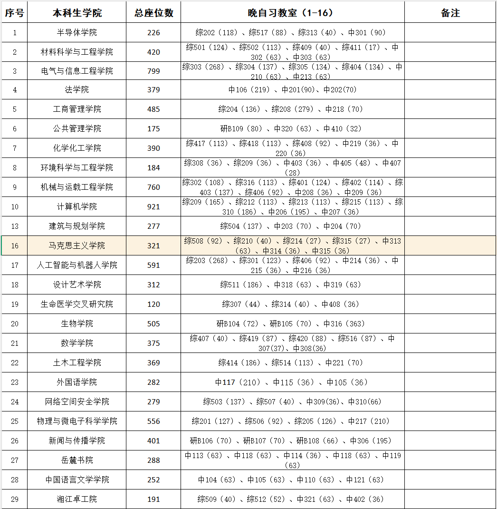

# 关于2026-2027年秋季学期学生自习教室分配通知

- 公众号：湖大有话说
- 作者：分享湖大资讯的
- 日期：2026-09-13
- 原文：https://mp.weixin.qq.com/s?src=11&timestamp=1790358642&ver=6988&signature=nGNZgjFcvYQZjkjASEXVfhV30tN1tKyEaxzsjsMFP991ExHkhRV5AWJOeMAjTyFbLLYfXm3TMWRzds4qZeYBbQb-AhGGh0yrPblJWnC4yALfySSl1q537xMAcwkQG3sL&new=1

[图片]

各学院：

为进一步优化教学资源，合理使用空闲教室，现将南校区综合楼、中楼等教室资源分配到各学院作为自习教室使用，具体通知如下：

一、分配情况

1.南校区以各学院大一、大二年级学生人数为基数，将空闲教室、座位，按学院人数分配到各学院，具体分配情况如下

[图片]

2.各学院将综合楼优先安排大一新生自习，剩余的教室学院可以根据实际情况自行安排大二学生自习。

3.财院校区的自习教室已由教务处统一安排，请各学院辅导员至学院教学秘书处查看。

二、可用时段

周一到周日19:00-21:35

注：本学期9-11周周二下午，周一至周五晚上会在中楼和综合楼安排期中考试，若本学院所使用的自习室被安排了考试，请提前改到未安排考试的自习室进行自习

三、使用说明

1.自习教室用途为学生自习、考研复习、学术讲座、班团建设等，不得用于商业宣传、非法活动及其他未经批准的活动，不得私自转借、调换教室。使用时段内，由学院进行管理和维护。

2.使用时段内，如需使用多媒体，请按照教务处要求，提前办理线下借教室手续。

3.请学院在使用结束后，提醒学生带走随身携带的物品。

4.已分配给学院的自习教室，学校不再安排其它教学活动。确有临时需要的，由教务处提前联系学院进行调整。

5.如遇大型考试等特殊情况需闭楼的，请服从学校统一安排。

四、工作要求

请学院在开展此项工作时，提前宣传部署，准确传达通知内容，并结合学院实际情况，做好教室分配，合理安排本院自习教室的使用人员和时段。

党委学生工作部（学生工作处）

2026年9月11日

额外Tip

[图片]

📌想在本学期拿驾驶证的同学注意啦！

🚗可以选择报名校内驾校!

⚡199元定金即抵扣1200元，名额有限!

👇最新优惠：

湖南大学这学期要考驾照的同学看过来！

[图片][图片]

-END-

有问题想请大家帮忙出主意？

想看看湖大的瓜田趣事？

有闲置物品想要出掉？

想找到喜欢的那个Ta或者结交更多朋友？

有需要跑腿接单？

那就锁定湖大校园集市吧

[图片]

湖大人都在看👇

湖大有话说公众号后台关键词自助解答功能，发送关键词可浏览全部内容。“湖大有话说”使用指南~

发送【集市】可进入湖南大学校园论坛群

发送【兼职】可进入湖大兼职群

发送【二手】可进入湖大二手交易群

发送【四六级】可获取四六级资料

发送【ppt】可获取湖南大学ppt模版

近期湖南大学情报【点击可跳转】👇🏻

关于做好2026-2027学年家庭经济困难学生认定工作的通知

湖南大学2026年机器人工程（湘江科创实验班）入校选拔通知

湖南大学四六级报名通知

关于2026-2027学年秋季学期中南大学、湖南师范大学优质课程面向我校本科生开放选课的通知

这学期要考驾照的同学看过来！

👇🏻 关注湖大有话说，知湖大大小事 👇🏻

[图片]

## 图片

