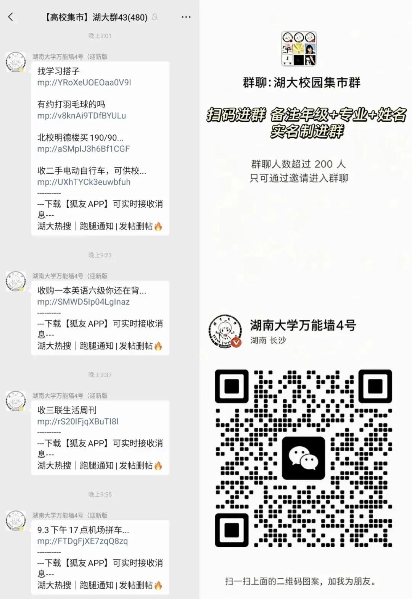

# 普通话考试报名和缴费的通知

- 公众号：湖大有话说
- 作者：分享考试资讯的
- 日期：2026-09-16
- 原文：https://mp.weixin.qq.com/s?src=11&timestamp=1790358620&ver=6988&signature=nGNZgjFcvYQZjkjASEXVfhV30tN1tKyEaxzsjsMFP983O6afmz3m8iyQQ*eos2qs6Qe6*Gtt9Re-f35tM6EHbCdTgBxtmzj1LKiGSZN8r6NriajBl5aiOYSwWEjv-sr2&new=1

[图片]

各位考生：

2026年上半年普通话水平测试拟定于11月7-8日举行，为做好本次普通话水平测试工作，现将报名和缴费的有关事项通知如下：

一、报名对象：本校在籍本科生、研究生

二、报名时间：9月17日12:00-9月21日24:00

三、报名方式：登录国家普通话水平测试在线报名系统（https://bm.cltt.org/#/index）进行报名，名额有限，报满即止。

四、缴费：

1.缴费时间：9月24日8:00-9月30日24:00

2.收费标准：25元/人(湘语测函【2024】1号)

3.缴费方式：

本次普通话水平测试的报名费通过湖南大学网上缴费系统进行收取，具体缴费方法：

登录湖南大学计划财务处网站（http://jcc.hnu.edu.cn/），点击“网上缴费”按钮，登录并按提示进行缴费操作，直至完成。

五、考试须知：

1.准考证需自行在报名系统内打印，开始时间为11月2日；

2.考生须持准考证和身份证提前半小时到达指定报到地点候考。未携带证件及逾期未到者，取消当次测试资格；

3.本测试将采用人脸识别系统现场采集考生人脸信息，专门用于登录考试系统和证书打印；考生不得佩戴首饰，头发不得遮挡眉毛、眼睛和耳朵，尽量不穿浅色衣服。

六、其他

1.已在其他考点报名参加测试，或已参加测试尚未公布成绩的，无法报名；

2.未按时缴纳报名费者将被视为自动放弃测试机会，取消报名资格；

3.本校教师、未报名成功等需要参加普通话水平测试的考生，请联系其他单位进行报名（http://hunanbm.cltt.org/pscweb/tel.html）；

4.联系方式：章老师，0731-88822147。

普通话水平测试湖南大学考点

2026年9月15日

额外Tip

[图片]

📌想在本学期拿驾驶证的同学注意啦！

🚗可以选择报名校内驾校!

⚡199元定金即抵扣1200元，名额有限!

👇最新优惠：

这学期要考驾照的同学看过来！

[图片]

-END-

有问题想请大家帮忙出主意？

想看看湖大的瓜田趣事？

有闲置物品想要出掉？

想找到喜欢的那个Ta或者结交更多朋友？

有需要跑腿接单？

那就锁定湖大校园集市吧

[图片]

湖大人都在看👇

湖大有话说公众号后台关键词自助解答功能，发送关键词可浏览全部内容。“湖大有话说”使用指南~

发送【集市】可进入湖南大学校园论坛群

发送【兼职】可进入湖大兼职群

发送【二手】可进入湖大二手交易群

发送【四六级】可获取四六级资料

发送【ppt】可获取湖南大学ppt模版

近期湖南大学情报【点击可跳转】👇🏻

关于做好2026-2027学年家庭经济困难学生认定工作的通知

招聘丨中国电信集团有限公司校内宣讲

湖大国庆、中秋放假通知

宿舍 | 食堂 | 图书馆 | 沉浸式进入湖南大学科创港校区

这学期要考驾照的同学看过来！

👇🏻 关注湖大有话说，知湖大大小事 👇🏻

[图片]

## 图片

