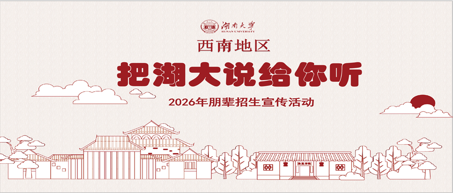
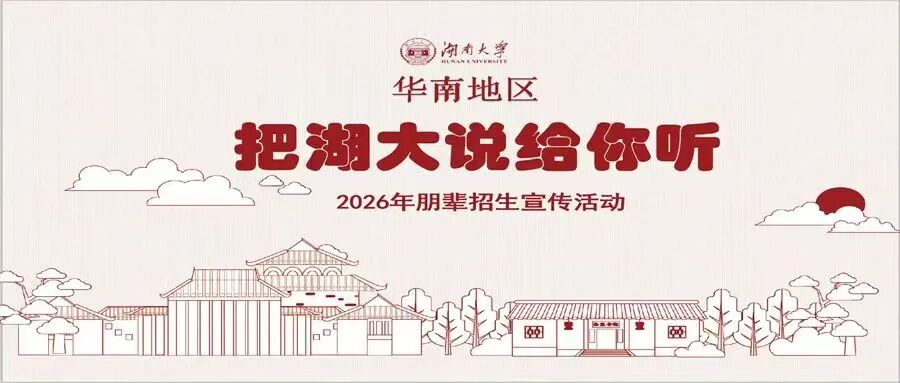
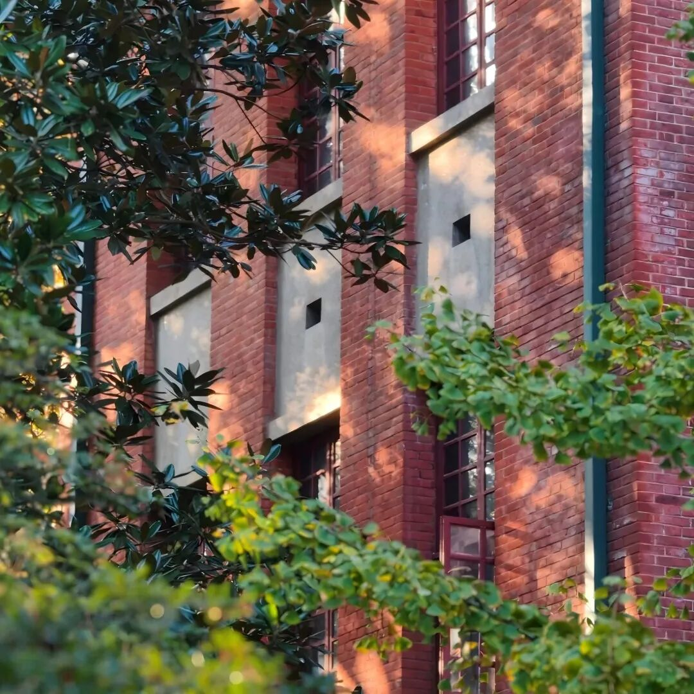
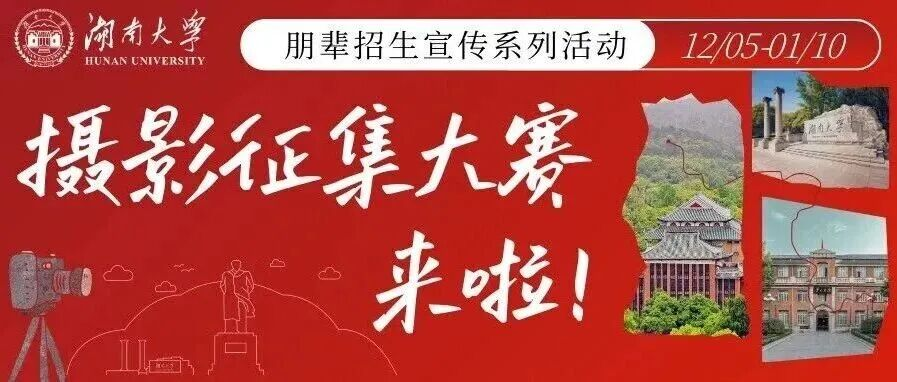
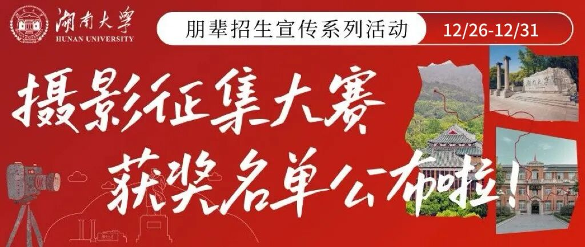

# 招新开启！湖南大学招生志愿者协会等你加入！

- 公众号：湖大有话说
- 日期：2026-09-24
- 原文：https://mp.weixin.qq.com/s?src=11&timestamp=1790357535&ver=6988&signature=nGNZgjFcvYQZjkjASEXVfhV30tN1tKyEaxzsjsMFP9-JGTdoZrRGedA412VGF7-FagJ13wa2G88OP*besb7N5nnCBqFnfA8NRKx9z4ZDeranoZwFqePof7CkdR98zAoM&new=1

[图片]

2026

湖南大学招生志愿者协会

招新啦！！！

在湖南大学，有这样一支志愿者队伍——
他们走近学弟学妹

分享自己的求学经历与就读体验
搭建起考生与湖南大学之间的沟通桥梁
是一支充满活力与奉献精神的志愿实践团队

如果你也愿意讲述真实的湖大体验
帮助更多学子了解湖南大学
欢迎加入湖南大学招生志愿者协会！

01.我们是谁

1

湖南大学招生志愿者协会

是由湖南大学本科生招生办公室指导

的学生社团

我们的主要职能是

协助本招办开展招生咨询活动

组织策划湖南大学系列招生宣传活动

整理与收集各类招生信息

我们的平台有

“湖南大学本科招生”公众号

“湖南大学本科招生”视频号

[图片]

02.我们的故事

1

“把湖大说给你听”

朋辈招生宣传活动

[图片]

[图片]

[图片]

[图片]

[图片]

点击链接查看活动内容

摄影征集大赛

[图片]

[图片]

[图片]

[图片]

左右滑动查看更多

[图片]

[图片]

点击链接查看活动内容

03.我们的构成

网宣部

1

主要职责：

[图片]

[图片]

·宣传物料制作：负责招志协日常活动的线上推广，产出与活动相关的宣传素材

·活动现场协助：配合其他部门开展活动，完成现场拍照录像、活动流程文稿撰写等工作

·平台账号运营：运营“湖南大学本科招生”官方微信公众号，进行推文排版工作；运营小红书账号，进行选题策划与内容推送

2

要求（满足其一即可）：

[图片]

[图片]

1.了解新媒体运营模式，掌握基础的推文排版、视频剪辑、海报制作等能力

2.拥有扎实的文字基础，具有一定的文案创作热情，能够撰写活动总结、推文文案

3.互联网深度用户，对前沿话题有一定的敏感度，拥有一定的创新意识与审美能力

4.持有相机等专业设备(√加分项)

3

招新人数：

[图片]

[图片]

18-20人

活动部

1

主要职责：

[图片]

[图片]

·活动组织与策划：负责招生活动、协会团建等前期策划与后期备案

·活动执行与保障：负责活动场地布置与氛围营造，并协助其他工作人员进行秩序维护

2

要求（满足其一即可）：

[图片]

[图片]

1.擅长人际交往，具备一定的沟通能力与随机应变能力，能够处理突发状况

2.拥有一定的创新能力和天马行空的想象力，能够提出比较新颖的点子

3.拥有一定的组织能力，能够对活动、会议进程进行统筹规划

3

招新人数：

[图片]

[图片]

8-10人

资信部

1

主要职责：

[图片]

[图片]

·资料整理：做好各项活动前期的信息收集与资料整理

·工作对接:在各项活动中协助其他部门完成工作对接与信息存档

2

要求（满足其一即可）：

[图片]

[图片]

1.严谨细致，能够有条不紊地完成任务

2. 拥有相对充足的工作时间和基础的Office、WPS等办公软件使用能力

3. 具有较强的时间管理能力，能够合理安排工作，确保各项任务按时完成

3

招新人数：

[图片]

[图片]

8-10人

[图片]

湖大麓

加入我们，你可以

✅掌握湖南大学招生最新资讯

✅参与招生宣传主题活动策划，锻炼组织统筹思维

✅在实践活动中提升沟通协作、临场应变能力

✅收获展示自我的平台，结识志同道合的伙伴

✅参与社团团建，收获专属文创周边

在实践中收获成长，期待你的加入！

#招新#招志协

5分钟前

[图片]

欢迎同学们踊跃报名❀

[图片]

[图片]

扫码入群报名截止日期

9月30日

进群后会组织一轮线下面试

欢迎有热情、有责任、有创意的你一起讲好湖大故事

图文|湖南大学招生志愿者协会

## 图片

