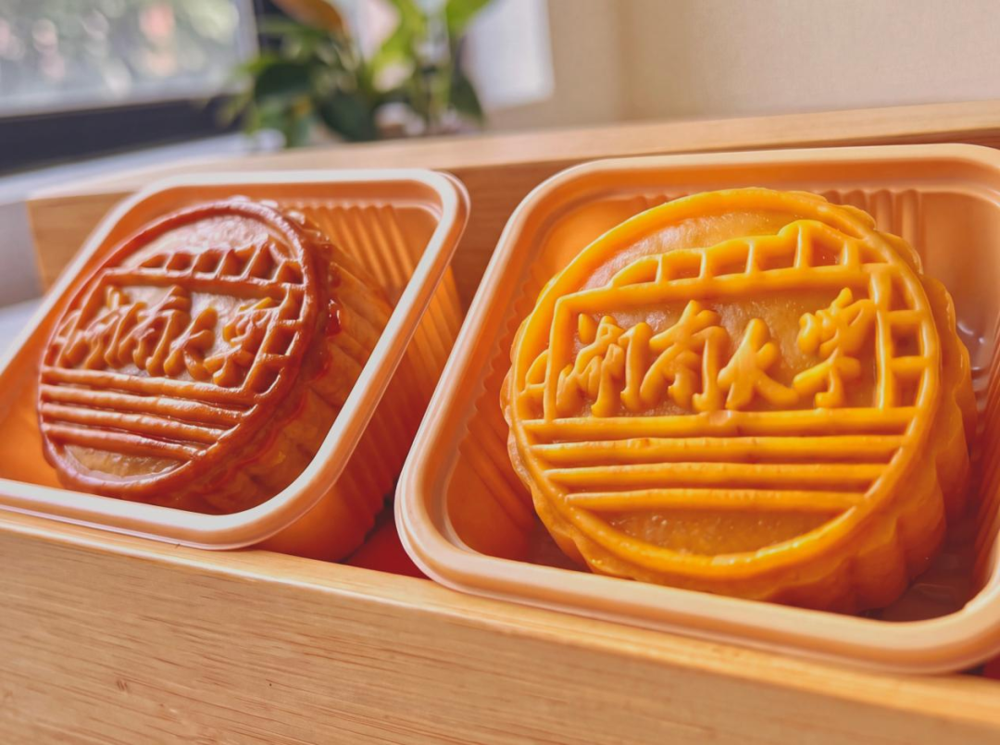
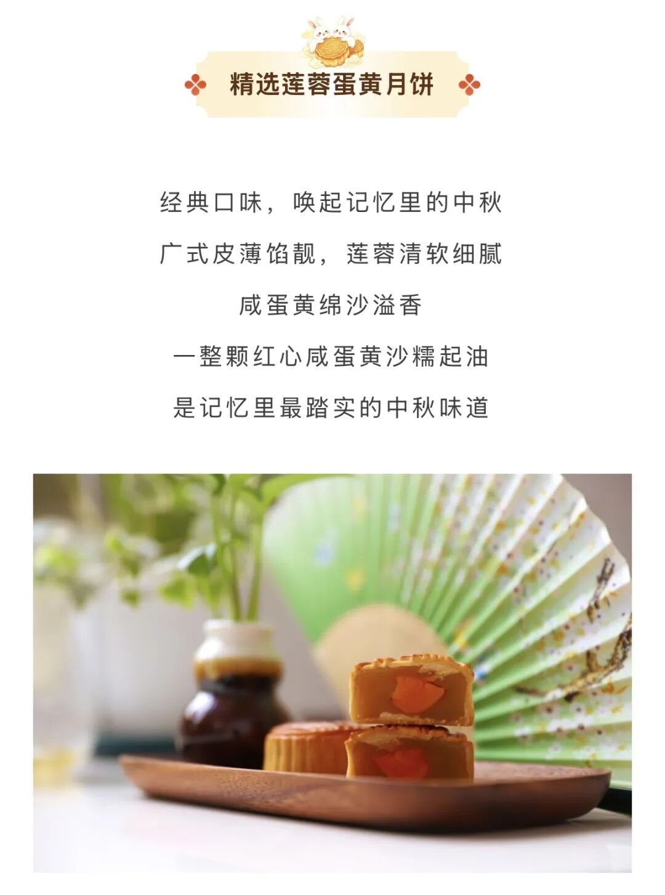
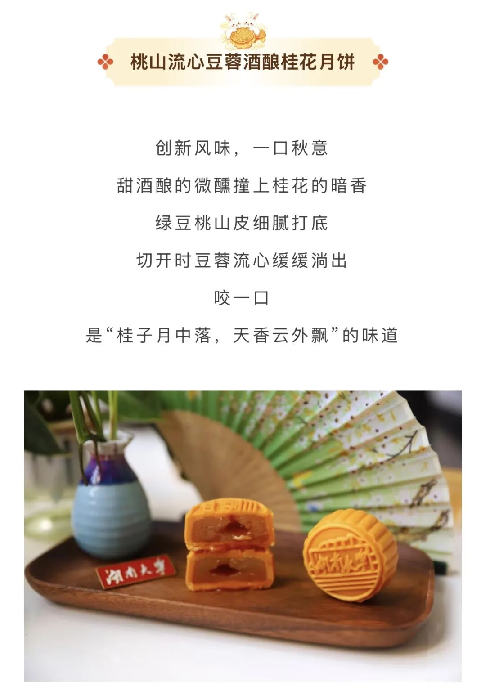
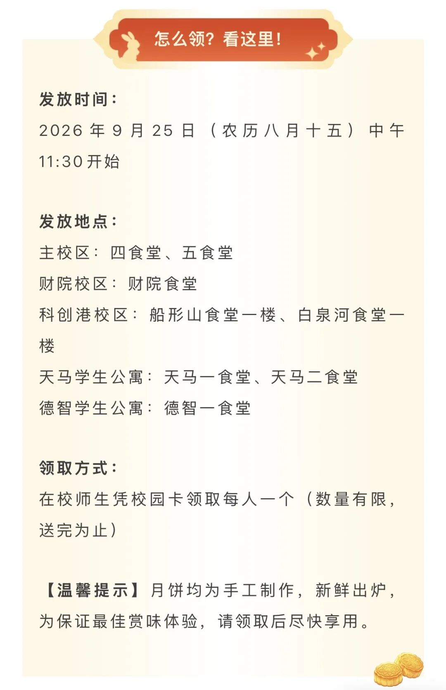
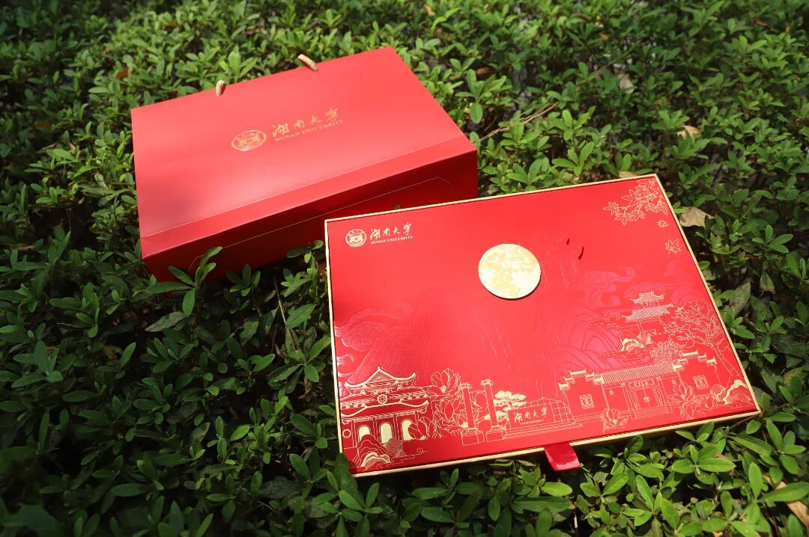
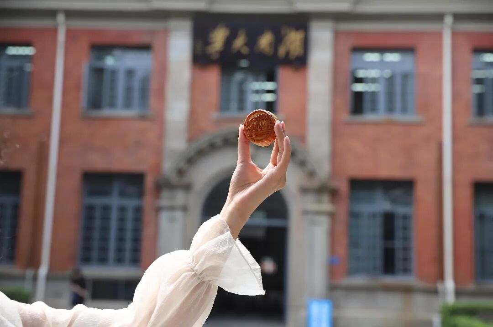

# @全体师生，湖大请你吃月饼啦

- 公众号：湖大有话说
- 作者：祝你中秋快乐的
- 日期：2026-09-25
- 原文：https://mp.weixin.qq.com/s?src=11&timestamp=1790357539&ver=6988&signature=nGNZgjFcvYQZjkjASEXVfhV30tN1tKyEaxzsjsMFP9-3KzMc3lGOywHQIDvaTdtsfTwmWakbF4YtnXoVsPqT7gbK-Bd9oLBWGdhdkhhDeezXoMavx2kZB4SOFnQsf7MT&new=1

[图片]

秋风起，桂子香

中秋，是月亮替人间写的一封家书

不论你身处何处，抬头望向圆月那一刻
就是属于我们湖大人的团圆

[图片]

今年湖大月饼新鲜出炉啦！

两种口味的定制月饼

让你在学校也能过一个温暖开心的节

[图片]

[图片]

[图片]

[图片]

[图片]

[图片]

[图片]

[图片]

[图片]

[图片]

[图片]

愿每一位湖大人

抬头有明月，身边有温情

岁岁安康，万事顺遂

中秋快乐！

来源：湖南大学官方微信公众号

额外Tip

[图片]

📌想在本学期拿驾驶证的同学注意啦！

🚗可以选择报名校内驾校!

⚡199元定金即抵扣1200元，名额有限!

👇最新优惠：

湖南大学这学期要考驾照的同学看过来！

[图片]

有问题想请大家帮忙出主意？

想看看湖大的瓜田趣事？

有闲置物品想要出掉？

想找到喜欢的那个Ta或者结交更多朋友？

有需要跑腿接单？

那就锁定湖大校园集市吧

[图片]

[图片]

湖大er都在看👇

湖南大学考试学习资料汇总

2025-2026学年本科生国家奖学金、国家励志奖学金评审开始

关于开展2025-2026学年度第一批评优工作的通知（含综合奖学金及荣誉称号等项目）

招新开启！湖南大学招生志愿者协会等你加入！

湖大国庆、中秋放假通知

这学期要考驾照的同学看过来！

👇🏻 关注湖大有话说，知湖大大小事 👇🏻

[图片]

## 图片

